# Tarea 2 - Dockerizar Aplicación con Multi-Stage Build

> 🎯 Objetivo general

Aplicar los conocimientos de Dockerfiles y multi-stage builds para containerizar una aplicación propia, optimizarla y publicarla en Docker Hub.


# <mark>📘 Node.js</mark>
## 🗂 Opción 1: Aplicación Node.js
> Crea o usa una aplicación Node.js/Express con:
* Al menos 2 endpoints
* Dependencias en package.json
* Puerto configurable

## <mark>🔥 1: Descripción de la Aplicación</mark>
* Lenguaje y framework utilizado: **Node JS, Express**
* Endpoints disponibles: 
  * GET **/**
  * GET **/api/info**
  * GET **/api/saludo**
* Funcionalidad básica: **Muestra pagina de bienvenido y en esa pagina tambien se  encuentra 2 links que hace referencia a los 2 endpoints que solo muestra informacion y un saludo.**

### 👉Estructura del proyecto.
```bash
node/
├── .dockerignore
├── .env
├── .gitignore
├── app.js
├── Dockerfile
├── package-lock.json
├── package.json
├── README.md
└── node_modules/

```
### 👉 Archivo principal app.js.
```js
// app.js
const express = require("express");
require("dotenv").config(); // Carga las variables del archivo .env

const app = express();
const port = process.env.PORT || 3000; // Puerto configurable con valor por defecto

// Middleware para que la app reciba JSON
app.use(express.json());

// Endpoint prinicpal: pagina bienvenido
app.get("/", (req, res) => {
  res.send(`
    <!DOCTYPE html>
    <html lang="es">
    <head>
      <meta charset="UTF-8">
      <meta name="viewport" content="width=device-width, initial-scale=1.0">
      <title>Porfirio Ramos</title>
      <style>
        body {
          font-family: Arial, sans-serif;
          background-color: #f4f4f4;
          color: #333;
          text-align: center;
          padding: 20px;
        }
        h1 {
          color: #0044cc;
          font-size: 2.5em;
        }
        p {
          font-size: 1.2em;
        }
        img {
          max-width: 200px;
          border-radius: 10px;
          margin-top: 20px;
        }
        .links {
          margin-top: 30px;
        }
        .links a {
          text-decoration: none;
          color: #007bff;
          font-size: 1.2em;
          margin: 10px;
        }
        .links a:hover {
          text-decoration: underline;
        }
      </style>
    </head>
    <body>
      <h1>¡Bienvenido a mi API!</h1>
      <p>Mi nombre es Porfirio Ramos y esta es mi API.</p>
      <h3>Curso de Docker y Kubernetes en:</h3>

      
      <div class="links">
        <p>Visita los siguientes endpoints:</p>
        <a href="/api/saludo"> /api/saludo</a> | 
        <a href="/api/info">/api/info</a>
      </div>
    </body>
    </html>
  `);
  //
});
// Endpoint 1: Saludo
app.get("/api/saludo", (req, res) => {
  res.json({
    success: true,
    status: 200,
    mensaje:
      "¡Hola, bienvenido a la API! Del curso de Docker y Kubernetes en I-QUATRO"
  });
});

// Endpoint 2: Info sobre la app
app.get("/api/info", (req, res) => {
  res.json({
    success: true,
    status: 200,
    mensaje:
      "Esta es una aplicación de ejemplo con Node.js y Express, del Curso de DOCKER",
    version: "1.0.0"
  });
});

// Iniciar el servidor
app.listen(port, () => {
  console.log(`Servidor corriendo en el puerto ${port}`);
});

```
### 👉 Archivo package.json.
```js
{
  "name": "node",
  "version": "1.0.0",
  "description": "Aplicacion Node para dockerizar",
  "license": "MIT",
  "author": "Porfirio Ramos",
  "type": "commonjs",
  "main": "index.js",
  "scripts": {
    "dev": "node app.js"
  },
  "dependencies": {
    "dotenv": "^17.2.3",
    "express": "^5.1.0"
  }
}
```
### 🚀 Comandos Ejecutados:

> Para hacer correr la aplicacion
* `npm init`
* `npm install dotenv express`
* `npm run dev`

### 👉 Resultado en local.
> <h3> 🛠 Página de bienvenido</h3>
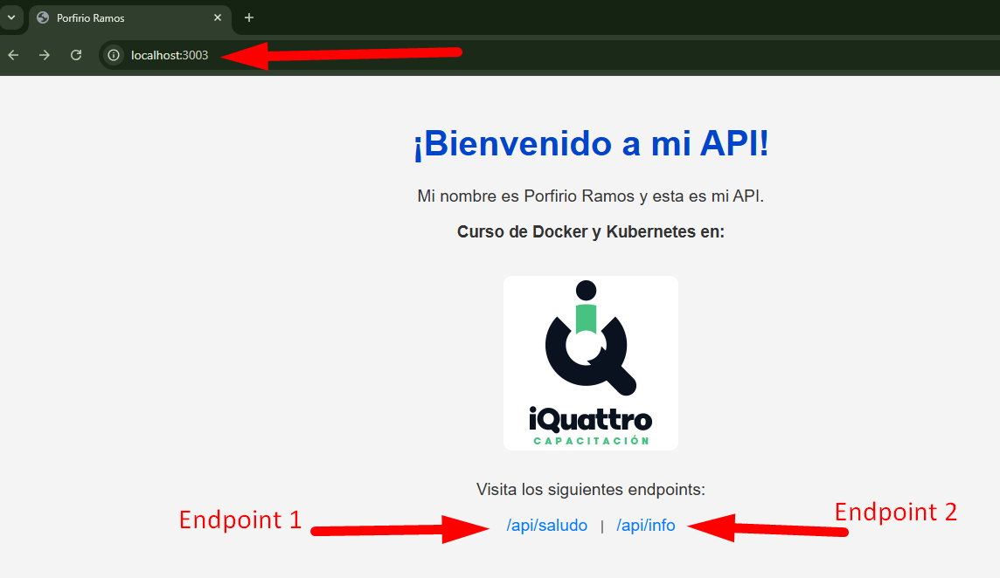
> <h3> 🛠 Endpoint Saludo</h3>
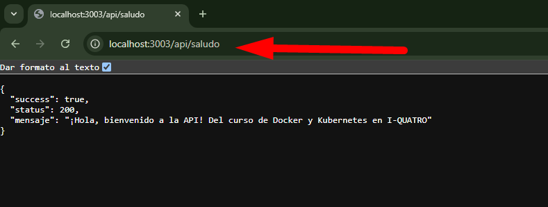
> <h3> 🛠 Endpoint Info</h3>
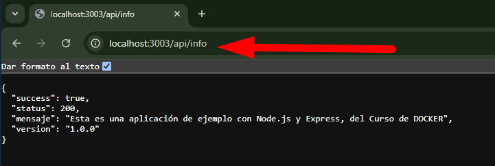
> <h3> 🛠 Terminal</h3>
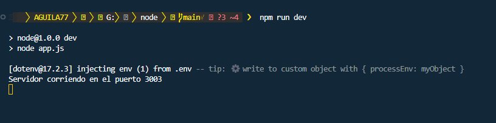

## <mark>🔥 2: Dockerfile</mark>

### 👉 Archivo completo Dockerfile.
```Dockerfile
# --- Stage 1: Build / Compilation ---
FROM node:alpine3.22 AS build

# Establecer directorio de trabajo
WORKDIR /app

# Copiar solo los archivos necesarios para instalar las dependencias
COPY package.json package-lock.json ./

# Instalar dependencias de desarrollo (devDependencies)
RUN npm install --production=false

# Copiar el resto del código de la aplicación
COPY . .


# --- Stage 2: Production / Runtime ---
FROM node:alpine3.22 AS production

# Crear usuario no-root para mayor seguridad
RUN addgroup -g 1001 -S nodejs && \
    adduser -S nodejs -u 1001

# Establecer directorio de trabajo
WORKDIR /app

# Copiar solo package.json y package-lock.json
COPY package*.json ./

# Instalar solo las dependencias de producción (no devDependencies)
RUN npm install --production=true && \   
    npm cache clean --force

# Copiar el archivo de dependencias de producción desde el stage de build
COPY --from=build /app/app.js ./


# Copiar solo los archivos necesarios para la ejecución (evitar copiar el código fuente innecesario)
COPY --from=build /app/ /app/

# Cambiar ownership de los archivos al usuario nodejs
RUN chown -R nodejs:nodejs /app

# Cambiar a usuario no-root
USER nodejs

# Configurar el puerto en el que la aplicación escuchará
EXPOSE 8083

# Definir las variables de entorno necesarias
ENV NODE_ENV=production
ENV PORT=8083

# Agregar etiquetas (metadata) para identificación
LABEL maintainer="porfirioramosfernandez@gmail.com"
LABEL version="1.0"
LABEL description="Aplicación Node.js con Docker optimizada"


# Comando para iniciar la aplicación
CMD ["node", "app.js"]


# Health check
HEALTHCHECK --interval=30s --timeout=3s --start-period=5s --retries=3 \
  CMD node -e "require('http').get('http://localhost:8083/health', (r) => {process.exit(r.statusCode === 200 ? 0 : 1)})"

```
### 👉 Explicación de cada stage.
> <h3> 🛠 Stage 1: Build / Compilation</h3>
**1 - FROM node:alpine3.22 AS build:**

* Este es el primer stage (etapa) donde se usa la imagen base node:alpine3.22. alpine es una versión ligera de Linux, ideal para reducir el tamaño de la imagen Docker.

* AS build es una etiqueta que define este stage como build, lo que permite referirse a él más adelante en el segundo stage.

**2 - WORKDIR /app:**

* Establece el directorio de trabajo dentro del contenedor. Todos los comandos que se ejecuten después de este comando estarán dentro de este directorio.

**3 - COPY package.json package-lock.json ./:**

* Copia los archivos package.json y package-lock.json (que contienen la información de las dependencias) a la carpeta /app dentro del contenedor.

**4 - RUN npm install --production=false:**

* Instala las dependencias del proyecto, incluidas las de desarrollo (devDependencies). Esto es necesario solo durante la etapa de construcción, ya que en producción solo necesitamos las dependencias regulares.

**5 - COPY . .:**

* Copia todo el código fuente del proyecto (el contenido del directorio donde está el Dockerfile) al contenedor. Esto incluye los archivos de la aplicación que se ejecutarán más adelante.
> <h3> 🛠 Stage 2: Production / Runtime</h3>
**1 - FROM node:alpine3.22 AS production:**

* Este es el segundo stage, donde usamos nuevamente una imagen base de Node.js (node:alpine3.22), pero esta vez orientada a producción, y lo etiquetamos como production.

**2 - RUN addgroup -g 1001 -S nodejs && adduser -S nodejs -u 1001:**

* Este comando crea un usuario nodejs sin privilegios de root, lo cual es una buena práctica de seguridad para evitar que la aplicación se ejecute como root dentro del contenedor.

**3 - WORKDIR /app:**

* Establece el directorio de trabajo nuevamente como /app dentro del contenedor para trabajar con la aplicación.

**4 - COPY package\*.json ./:**

* Copia solo los archivos package.json y package-lock.json del host al contenedor para poder instalar las dependencias.

**5 - RUN npm install --production=true && npm cache clean --force:**

* Instala solo las dependencias de producción, ya que las dependencias de desarrollo no son necesarias en el entorno de producción. Además, se limpia la caché de npm para reducir el tamaño final de la imagen.

**6 - COPY --from=build /app/app.js ./:**

* Copia el archivo app.js (o cualquier archivo de inicio) desde el stage de build (--from=build), asegurando que solo se copien los archivos necesarios para ejecutar la aplicación en producción.

**7 - COPY --from=build /app/ /app/:**

* Copia el resto de los archivos de la aplicación desde el stage de build, pero solo los archivos necesarios para la ejecución. Aquí es importante que no se copien archivos no deseados de desarrollo.

**8 - RUN chown -R nodejs:nodejs /app:**

* Cambia la propiedad de todos los archivos copiados a nodejs, el usuario no-root creado previamente.

**9 - USER nodejs:**

* Cambia al usuario nodejs, asegurando que la aplicación se ejecute con permisos limitados.

**10 - EXPOSE 8083:**

* Expone el puerto 8083 para que la aplicación sea accesible desde fuera del contenedor.

**11 - ENV NODE_ENV=production y ENV PORT=8083:**

* Establece las variables de entorno necesarias, como NODE_ENV para indicar que el entorno es de producción y PORT para el puerto que escuchará la aplicación.

**12 - LABEL:**

* Añade metadatos sobre el contenedor, como el mantenedor, la versión y la descripción de la imagen Docker.

**13 - CMD ["node", "app.js"]:**

* Define el comando que se ejecutará cuando el contenedor se inicie. En este caso, arranca la aplicación con node app.js.

**14 - HEALTHCHECK:**

* Define un check de salud para asegurar que la aplicación esté funcionando correctamente. Este comando verifica la respuesta HTTP en la URL /health cada 30 segundos, y si la respuesta no es 200, se considera un fallo.
### 👉 Tabla explicando instrucciones principales
| Instrucción                            | Descripción                                                             |
|----------------------------------------|-------------------------------------------------------------------------|
| FROM node:alpine3.22 AS build          | Especifica que la imagen base para el stage de compilación es la versión alpine3.22 de node, que es ligera y adecuada para crear imágenes eficientes. Aquí se instalan las dependencias de desarrollo.  |
| WORKDIR /app                           | Define el directorio de trabajo dentro del contenedor como /app. Todos los comandos posteriores se ejecutarán desde este directorio.       |
| COPY package.json package-lock.json ./ | Copia los archivos package.json y package-lock.json al contenedor para poder instalar las dependencias sin copiar el resto del código aún. |
| RUN npm install --production=false     | Instala las dependencias, incluyendo las dependencias de desarrollo (devDependencies), en el contenedor para el proceso de construcción.   |
| COPY . .                               | Copia todo el código fuente de la aplicación al contenedor. Esto se hace después de instalar las dependencias para asegurar que las dependencias no se instalen innecesariamente si no se modifican los archivos de código. |
| FROM node:alpine3.22 AS production     | Define el stage de producción, que se basa también en una imagen ligera de node:alpine3.22, pero solo instalará las dependencias necesarias para la producción.  |
| RUN addgroup -g 1001 -S nodejs && adduser -S nodejs -u 1001 | Crea un grupo y un usuario no-root (nodejs) para mejorar la seguridad, evitando ejecutar la aplicación como el usuario root.  |
| COPY package.json ./*                  | Copia solo los archivos package.json y package-lock.json en el contenedor de producción para instalar las dependencias de producción. |
| RUN npm install --production=true && npm cache clean --force | Instala solo las dependencias necesarias para producción (--production=true), y luego limpia la caché de npm para reducir el tamaño de la imagen. |
| COPY --from=build /app/app.js ./       | Copia el archivo app.js desde el stage de compilación al stage de producción. |
| COPY --from=build /app/ /app/          | Copia el resto de los archivos necesarios desde el stage de compilación al stage de producción. Se evitan archivos innecesarios (como archivos de desarrollo). |
| RUN chown -R nodejs:nodejs /app        | Cambia la propiedad de todos los archivos a nodejs, el usuario no-root que se creó anteriormente. |
| USER nodejs                            | Cambia el usuario en el contenedor para ejecutar la aplicación como nodejs, en lugar de como root. |
| EXPOSE 8083                            | Expone el puerto 8083, que es el puerto en el que la aplicación estará escuchando. Esto es solo informativo para Docker y no tiene efecto directo en el contenedor. |
| ENV NODE_ENV=production                | Define la variable de entorno NODE_ENV como production, lo cual es útil para las configuraciones de la aplicación que dependen de este valor (como la activación de optimizaciones de producción). |
| ENV PORT=8083                          | Establece el valor de la variable de entorno PORT en 8083, lo que indica a la aplicación en qué puerto debe escuchar. |
| LABEL maintainer="..."                 | Añade una etiqueta para identificar al mantenedor de la imagen (en este caso, tú). Es útil para metadata y referencia. |
| LABEL version="1.0"                    | Añade una etiqueta con la versión de la imagen, útil para control de versiones. |
| LABEL description="..."                | Añade una etiqueta con una breve descripción de la imagen para la documentación o referencia. |
| HEALTHCHECK --interval=30s --timeout=3s --start-period=5s --retries=3 CMD node -e "require('http').get('http://localhost:8083/health', (r) => {process.exit(r.statusCode === 200 ? 0 : 1)})"                 | Configura una comprobación de estado (health check) para la aplicación. Verifica si la aplicación está en funcionamiento mediante una solicitud HTTP al endpoint /health en el puerto 8083, con intervalos y tiempos de espera definidos. |
| CMD ["node", "app.js"]                 | Define el comando predeterminado que se ejecutará cuando el contenedor inicie: ejecutar el archivo app.js con Node.js.. |
## <mark>🔥 3. Proceso de Build</mark>


### 🚀 Comandos Ejecutados

> Terminal
* `docker build -t nodejs-api:1.1 .`
* `docker run -d -p 8083:8083 --name api-custom nodejs-api:1.1`

### 🚀 Salida del build (primeras y últimas líneas)
> <h3> 🛠 Primeras lineas Build</h3>
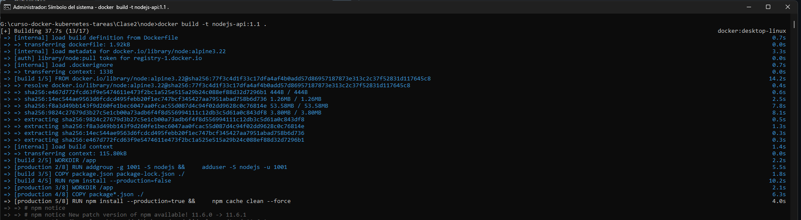
> <h3> 🛠 Build completo</h3>
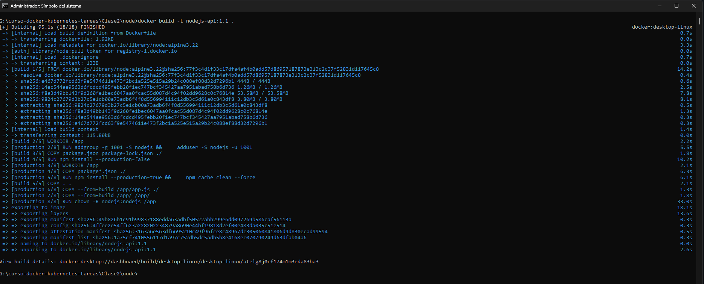
### 🚀 Tamaño final de la imagen
> <h3> 🛠 Tamaño de la Imagen desde Terminal</h3>
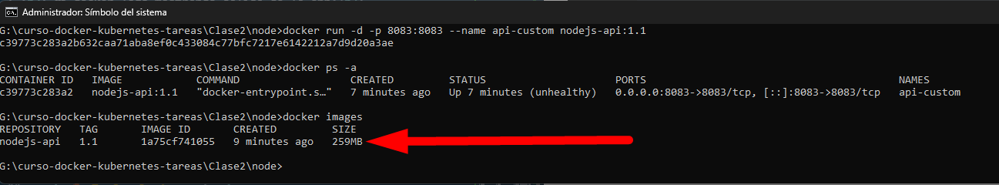
## <mark>🔥 4. Testing Local</mark>
### 🚀 Comandos para ejecutar el container:
> Terminal
* `docker build -t nodejs-api:1.1 .`
> <h3> 🛠 Corriendo en el puerto 8083 Docker Desktop y Terminal</h3>
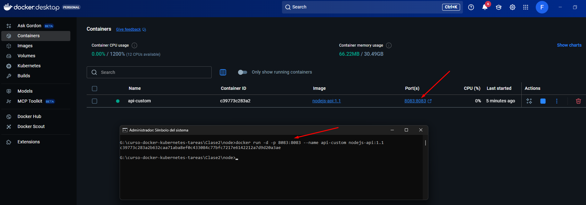
### 🚀 Screenshots de:
> <h3> 🛠 docker images mostrando tu imagen</h3>
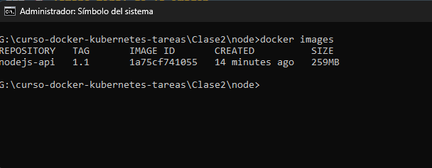
> <h3> 🛠 docker ps con el container corriendo</h3>
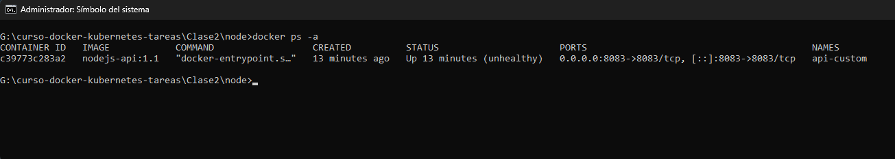
> <h3> 🛠 Navegador o curl probando endpoints</h3>
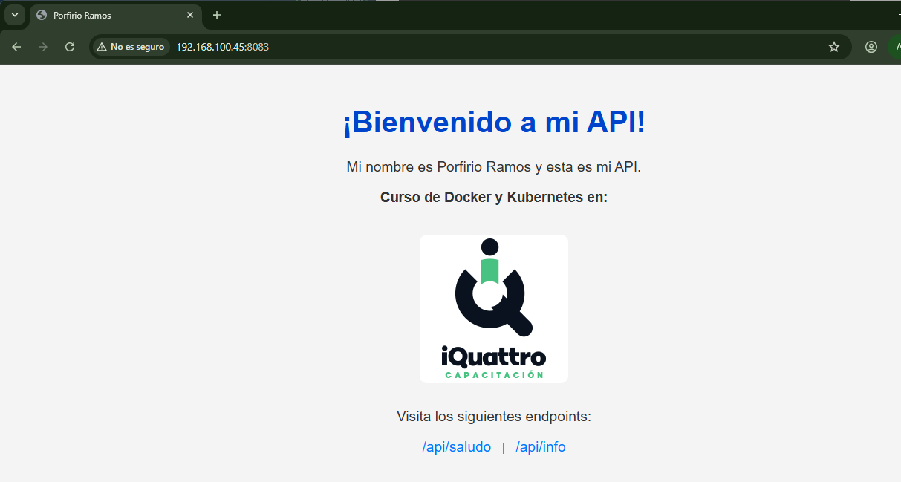
> <h3> 🛠 docker logs mostrando salida de la app</h3>
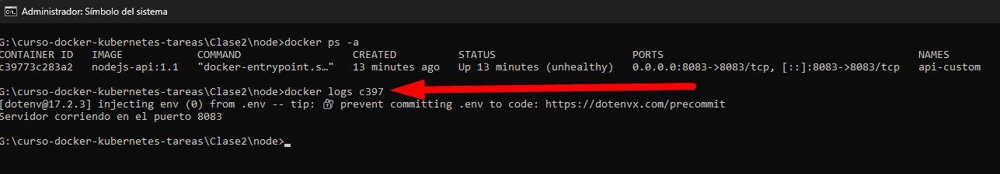
## <mark>🔥 5. Publicación en Docker Hub</mark>
> **Terminal**
### 🚀 Comandos de tag y push:
* `docker tag nodejs-api:1.1 fast777/api-custom`
* `docker push fast777/api-custom`
### 🚀 URL pública de tu imagen en Docker Hub:
> https://hub.docker.com/r/fast777/api-custom/tags
### 🚀 Screenshot de la página en Docker Hub:
> <h3> 🛠 Página de Docker Hub</h3>
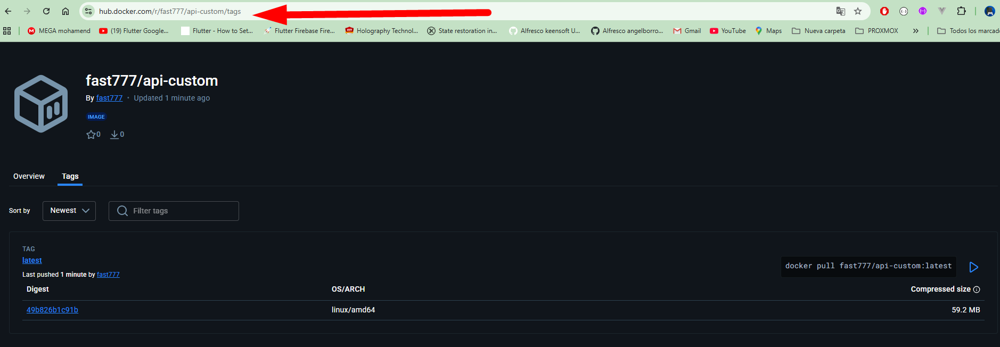
## <mark>🔥 6. Optimizaciones Aplicadas</mark>
### 🚀 Comparación de tamaños (si hiciste build sin multi-stage):
La comparacion que se pudo ver, es que sin multi-stage la imagen es mas grande
### 🚀 Qué optimizaciones aplicaste:
> <h5> 🛠 1 Uso de Multi-Stage Builds</h5>
* **Optimización:** El uso de multi-stage builds permite separar la construcción de la aplicación del entorno de ejecución.

* **Beneficio:** Esto reduce el tamaño de la imagen final, ya que solo se copian los artefactos necesarios para la producción (por ejemplo, el código fuente y las dependencias mínimas). En el primer stage, se instalan todas las dependencias, mientras que en el segundo stage, solo se copian las dependencias de producción y el código necesario
> <h5> 🛠 2. Instalación de Dependencias Solo en el Build Stage</h5>
* **Optimización:** En el primer stage, se instalan todas las dependencias, incluidas las de desarrollo (devDependencies).
* **Beneficio:** Esto garantiza que las dependencias de desarrollo solo estén presentes en el contenedor de construcción y no en el contenedor final para producción. Solo las dependencias necesarias para la ejecución se copian en el stage de producción.
> <h5> 🛠 3. Instalación de Solo Dependencias de Producción en el Production Stage</h5>
* **Optimización:** En el segundo stage, se instalan solo las dependencias necesarias para la producción:
* **Beneficio:** Esto reduce aún más el tamaño de la imagen final, ya que las dependencias de desarrollo no se incluyen.
> <h5> 🛠 4. Copiar Solo Archivos Necesarios</h5>
* **Optimización:** En lugar de copiar todo el código fuente en el contenedor de producción, se copian solo los archivos esenciales.
* **Beneficio:** Esto evita que archivos innecesarios, como archivos de configuración o scripts de desarrollo, sean copiados en la imagen de producción.
> <h5> 🛠 5. Uso de un Usuario No Root</h5>
* **Optimización:** En el production stage, se crea un usuario no-root para ejecutar la aplicación.
* **Beneficio:** Esto mejora la seguridad, ya que ejecutar la aplicación como root dentro del contenedor puede ser riesgoso. Al usar un usuario no-root, se limita la exposición a vulnerabilidades.
> <h5> 🛠 6. Cambio de Propietario a nodejs</h5>
* **Optimización:** Después de copiar los archivos al contenedor de producción, se cambia la propiedad de los archivos a nodejs.
* **Beneficio:** Asegura que el usuario no-root (nodejs) tenga permisos adecuados para leer y ejecutar los archivos sin otorgar privilegios innecesarios.
> <h5> 🛠 7. Exposición de Puerto y Variables de Entorno</h5>
* **Optimización:** Se expone el puerto que la aplicación utilizará y se definen las variables de entorno necesarias para la ejecución en producción.
* **Beneficio:** Esto hace que la configuración de la aplicación sea más clara y facilita la gestión del contenedor en entornos de producción. También permite que la aplicación esté lista para ser accesible en el puerto adecuado.
> <h5> 🛠 8. Comando de Inicio de la Aplicación</h5>
* **Optimización:** Se define un comando de inicio explícito para la aplicación.
* **Beneficio:** Esto asegura que la aplicación se inicie correctamente cuando el contenedor se ejecute.
> <h5> 🛠 9. Health Check para Monitorizar la Aplicación</h5>
* **Optimización:** Se ha agregado un HEALTHCHECK que verifica si la aplicación está funcionando correctamente.
* **Beneficio:** Esto ayuda a garantizar que Docker monitoree la salud de la aplicación. Si la aplicación no responde correctamente, Docker podrá reiniciar el contenedor automáticamente, mejorando la fiabilidad de la aplicación.
> <h5> 🛠 10. Limpieza de Caché de NPM</h5>
* **Optimización:** Después de instalar las dependencias, se limpia la caché de npm.
* **Beneficio:** Esto reduce el tamaño final de la imagen, ya que elimina los archivos de caché de npm que no son necesarios en producción.

### 🚀 Capas de la imagen (docker history):
> <h3> 🛠 docker history ID</h3>
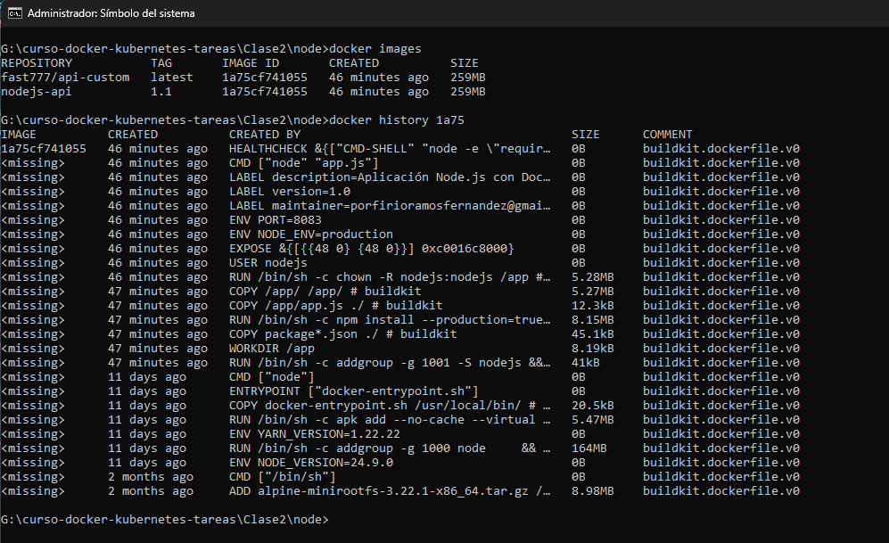
## <mark>🔥 7. Conclusiones</mark>
### 🚀 Dificultades encontradas:
Bueno aun tengo dificultades al construir el dockerfile
### 🚀 Qué aprendiste:
> <h3>  Lo principal que aprendi es los siguiente:</h3>
* Aprender comprender cada uno de los comandos de docker
* Subir mi imagen a docker hub
### 🚀 Diferencias con Clase 1: 
La diferencia es que la clase 2 es automático y listo para subir a docker hub y clase 1 es manual y local