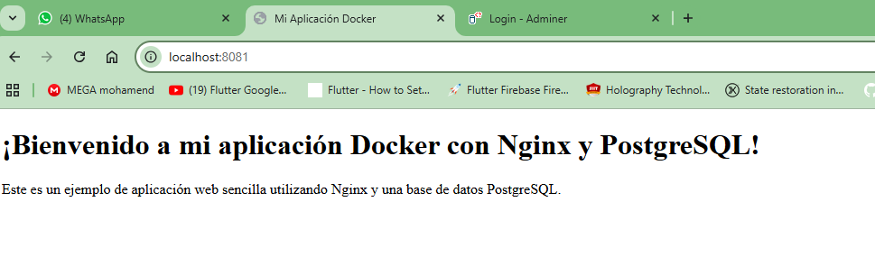
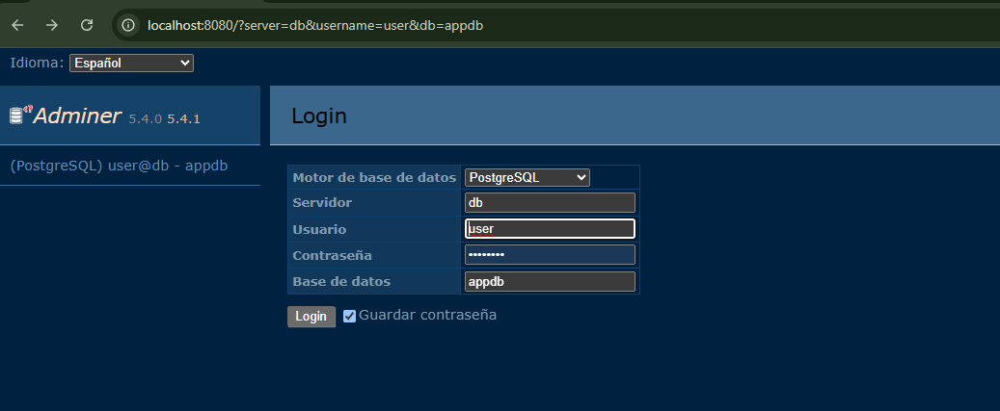
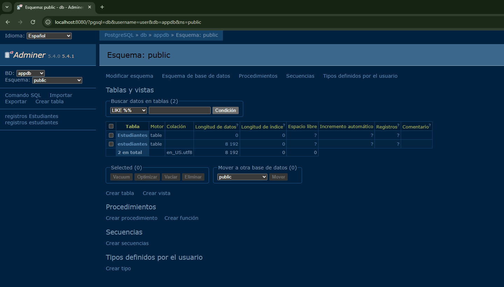
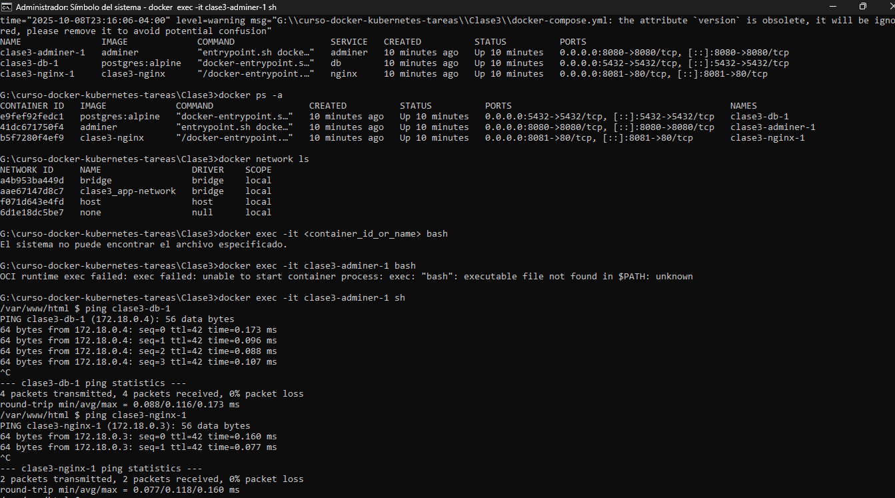

# Tarea 3 - Aplicación Multi-Contenedor con Docker Compose

> 🎯 Objetivo general

Crear una aplicación multi-contenedor usando Docker Compose, aplicando los conceptos de redes, volúmenes y orquestación de servicios aprendidos en clase.

## <mark>🔥 1. Encabezado</mark>
## 👉 Nombre de la Aplicación: clase3-nginex
**Curso:** Docker & Kubernetes - Clase 3

**Estudiante:** Porfirio Ramos Fernandez

**Breve descripción**

define tres servicios: un servidor Nginx para servir contenido estático, una base de datos PostgreSQL con persistencia de datos, y opcionalmente, Adminer como interfaz gráfica para gestionar la base de datos. Todos los servicios comparten una red común y volúmenes persistentes
## <mark>🔥 2. Stack Tecnológico</mark>
- **App:** Nginx / HTML / PHP
- **Base de datos:** PostgreSQL
## <mark>🔥 3. Cómo Ejecutar</mark>
1. Clonar:
   ```bash
   https://github.com/aguila777develop/curso-docker-kubernetes-tareas.git
   cd curso-docker-kubernetes-tareas
   ```
2. Levantar servicios:
   ```bash
   docker compose up -d
   ```
3. Acceder:
   ```bash
   http://localhost:8081/  # clase3-nginex
   http://localhost:8080/  #  Adminer corriendo
   ```
## <mark>🔥 4. Cómo Probar</mark>
> **Verificación:**
   ### 🚀 1 Servicios corriendo:
> **> docker ps**
   ```bash  
G:\curso-docker-kubernetes-tareas\Clase3>docker ps
CONTAINER ID   IMAGE             COMMAND                  CREATED        STATUS          PORTS                                         NAMES
82f94a6fd6da   adminer           "entrypoint.sh docke…"   47 hours ago   Up 49 seconds   0.0.0.0:8080->8080/tcp, [::]:8080->8080/tcp   clase3-adminer-1
478190702f1f   postgres:alpine   "docker-entrypoint.s…"   47 hours ago   Up 49 seconds   0.0.0.0:5432->5432/tcp, [::]:5432->5432/tcp   clase3-db-1
70419c0855fc   clase3-nginx      "/docker-entrypoint.…"   47 hours ago   Up 49 seconds   0.0.0.0:8081->80/tcp, [::]:8081->80/tcp       clase3-nginx-1
   ```
   ### 🚀 2 Acceder a la web:
   ```bash
   http://localhost:8081/  # clase3-nginex
   http://localhost:8080/  #  Adminer corriendo
   ```
   ### 🚀 3 Verificar volumen persiste::
   > **> docker compose down**
   ```bash
   G:\curso-docker-kubernetes-tareas\Clase3>docker compose down
time="2025-10-08T23:04:04-04:00" level=warning msg="G:\\curso-docker-kubernetes-tareas\\Clase3\\docker-compose.yml: the attribute `version` is obsolete, it will be ignored, please remove it to avoid potential confusion"
[+] Running 4/4
 ✔ Container clase3-db-1       Removed                                                                                                                                                                3.6s
 ✔ Container clase3-adminer-1  Removed                                                                                                                                                                3.6s
 ✔ Container clase3-nginx-1    Removed                                                                                                                                                                3.3s
 ✔ Network clase3_app-network  Removed                                                                                                                                                                0.7s

G:\curso-docker-kubernetes-tareas\Clase3>
   
   ```
   > **>   docker compose up -d**
   ```bash

   G:\curso-docker-kubernetes-tareas\Clase3>docker compose up -d
time="2025-10-08T23:05:32-04:00" level=warning msg="G:\\curso-docker-kubernetes-tareas\\Clase3\\docker-compose.yml: the attribute `version` is obsolete, it will be ignored, please remove it to avoid potential confusion"
[+] Running 4/4
 ✔ Network clase3_app-network  Created                                                                                                                                                                0.2s
 ✔ Container clase3-nginx-1    Started                                                                                                                                                                4.1s
 ✔ Container clase3-db-1       Started                                                                                                                                                                4.4s
 ✔ Container clase3-adminer-1  Started                                                                                                                                                                4.0s

G:\curso-docker-kubernetes-tareas\Clase3>
   
   ```
   > **> docker volume ls  # debe seguir existiendo**
   ```bash   
   G:\curso-docker-kubernetes-tareas\Clase3>docker volume ls
DRIVER    VOLUME NAME
local     0d132192449c2b1b12ebdc6e152fd665f9db9d7884f46458bd2c3b21d0d27391
local     7ba17657110d917cdf353d96991100ef7a12b54a1c7a2568762d566326177e73
local     clase3_db-data

G:\curso-docker-kubernetes-tareas\Clase3>

   
   ```
## <mark>🔥 5. Capturas de Pantalla</mark>
> **Screenshots**

### 🚀 Servicios corriendo
```bash
docker ps
```


### 🚀 API funcionando
> **Pàgina principal**

```bash
http://localhost:8081/
```



> **ADMINER credenciales**
- **Motor de base de datos:** PostgreSQL
- **Servidor:** db
- **Usuario:** user
- **Contraseña:** password
- **Base de datos:** appdb
```bash

http://localhost:8080/
```

> **ADMINER WEB**
```bash
http://localhost:8080/
```

> **Red-Custom**
```bash
G:\curso-docker-kubernetes-tareas\Clase3>docker network ls
NETWORK ID     NAME                 DRIVER    SCOPE
a4b953ba449d   bridge               bridge    local
aae67147d8c7   clase3_app-network   bridge    local
f071d643e4fd   host                 host      local
6d1e18dc5be7   none                 null      local

G:\curso-docker-kubernetes-tareas\Clase3>
```

## <mark>🔥 6. Conceptos Aplicados</mark>
> **Exec y ping**
```bash
G:\curso-docker-kubernetes-tareas\Clase3>docker compose ps -a
time="2025-10-08T23:16:06-04:00" level=warning msg="G:\\curso-docker-kubernetes-tareas\\Clase3\\docker-compose.yml: the attribute `version` is obsolete, it will be ignored, please remove it to avoid potential confusion"
NAME               IMAGE             COMMAND                  SERVICE   CREATED          STATUS          PORTS
clase3-adminer-1   adminer           "entrypoint.sh docke…"   adminer   10 minutes ago   Up 10 minutes   0.0.0.0:8080->8080/tcp, [::]:8080->8080/tcp
clase3-db-1        postgres:alpine   "docker-entrypoint.s…"   db        10 minutes ago   Up 10 minutes   0.0.0.0:5432->5432/tcp, [::]:5432->5432/tcp
clase3-nginx-1     clase3-nginx      "/docker-entrypoint.…"   nginx     10 minutes ago   Up 10 minutes   0.0.0.0:8081->80/tcp, [::]:8081->80/tcp

G:\curso-docker-kubernetes-tareas\Clase3>docker exec -it clase3-adminer-1 sh
/var/www/html $ ping clase3-db-1
PING clase3-db-1 (172.18.0.4): 56 data bytes
64 bytes from 172.18.0.4: seq=0 ttl=42 time=0.173 ms
64 bytes from 172.18.0.4: seq=1 ttl=42 time=0.096 ms
64 bytes from 172.18.0.4: seq=2 ttl=42 time=0.088 ms
64 bytes from 172.18.0.4: seq=3 ttl=42 time=0.107 ms
^C
--- clase3-db-1 ping statistics ---
4 packets transmitted, 4 packets received, 0% packet loss
round-trip min/avg/max = 0.088/0.116/0.173 ms
/var/www/html $ ping clase3-nginx-1
PING clase3-nginx-1 (172.18.0.3): 56 data bytes
64 bytes from 172.18.0.3: seq=0 ttl=42 time=0.160 ms
64 bytes from 172.18.0.3: seq=1 ttl=42 time=0.077 ms
^C
--- clase3-nginx-1 ping statistics ---
2 packets transmitted, 2 packets received, 0% packet loss
round-trip min/avg/max = 0.077/0.118/0.160 ms
/var/www/html $
```

## <mark>🔥 6. Conceptos Aplicados</mark>

> **Conceptos Docker**

- **Docker Compose con 2 servicios:** `Nginx PostgreSQL`
- **Red custom:** `app-network`
- **Volumen:** `db-data`
