# Tarea 4 - Microservicios con Cache y Gateway

> 🎯 Objetivo general

Construir una aplicación de microservicios que integre:

* Múltiples servicios backend
* Redis como cache
* Nginx como API Gateway
* Persistencia de datos
## <mark>🔥 1. Título y Descripción</mark>
👉 **Nombre del proyecto:** Ecommerce
👉 **Descripción breve de qué hace:**

Cliente se conecta al servicio api-gateway al puerto :8080 y este api-gateway es quien direcciona al servicio backend que esta en el puerto 5000 que se conecta a la base de datos postgres o direcciona al servicio products  que esta en el puerto 5001 que se conecta la base de datos mongodb. 
* **Lista todos los productos y usuarios**
* **Muestra productos y usuarios por id,**
* **Crea productos y usuarios**
* **Actualiza productos y usuarios**

👉 **Tecnologías utilizadas:**

```markdown

- Node.js 18
- Nginx (alpine)
- MongoDB 7
- Postgres 13
- Redis 7
- Docker & Docker Compose
```


## <mark>🔥 2. Arquitectura</mark>


```
┌────────────────────────────────────────────────────────────────────────────────────────┐
│                            Docker Compose Stack                                        │
│                                                                                        │
│                                ┌──────────┐                                            │
│                                │ Cliente  │                                            │
│                                │ (curl)   │                                            │
│                                └────┬─────┘                                            │
│                                     │                                                  │
│                                     │ http://localhost:8080                            │
│                                     ▼                                                  │
│                   ┌─────────────────────────────────────┐                              │
│                   │         NGINX GATEWAY               │                              │
│                   │           Port: 8080                │                              │
│                   └────┬─────────────┬───────────────┬──┘                              │
│                        │             │               │                                 │
│                   /api │             │ /             │                                 │
│                        │             │               │                                 │
│                        ▼             ▼               ▼                                 │
│ ┌──────────┐        ┌─────────┐ ┌──────────┐  ┌──────────┐           ┌──────────┐      │
│ │Postgres  │ ---->  │Backend  │ │ Frontend │  │ Products │ ------>   │ MongoDB  │      │
│ │5432:5432 │ <----  │API:5000 │ │ Nginx:80 │  │ API:5001 │ <------   │ :5001    │      │
│ └──────────┘        └─────────┘ └──────────┘  └──────────┘           └──────────┘      │
│      |                   │                         │                      |            |
|      |                   |                         |                      |            |
│ ┌────▼────────┐    ┌─────▼──────┐           ┌──────▼──────┐         ┌─────▼──────┐     │
│ │ postgres-db │    │Redis Cache │           │ Redis Cache │         │  mongo-db  │     |
│ │  (volume)   │    │   :5000    │           │ :5001       │         │  (volume)  │     │
│ └─────────────┘    └────────────┘           └─────────────┘         └────────────┘     │
│                          |                         |                                   │
│                          |                         |                                   │
│                ┌─────────▼─────────────────────────▼──────────┐                        │
│                │      app-network (custom bridge)             │                        │
│                │      DNS automático: backend, frontend       │                        │
│                └──────────────────────────────────────────────┘                        │
└────────────────────────────────────────────────────────────────────────────────────────┘
```

## Estructura del Proyecto

```
Clase4/
├── docker-compose.yml
├── nginx-config/
│   └── nginx.conf
├── backend/
│   ├── Dockerfile
│   ├── package.json
│   └── server.js
├── products/
│   ├── Dockerfile
│   ├── package.json
│   └── server.js
└── frontend/
    ├── Dockerfile
    └── index.html
```
## <mark>🔥 3. Servicios</mark>
| Servicio    | Tecnología | Puerto | Descripción   |
|----------   |------------|--------|-------------  |
| gateway     | Nginx      | 8080   | API Gateway   |
| backend     | Node.js    | 5000   | API principal |
| products    | Node.js    | 5001   | API           |
| redis       | Redis      | 6379   | Cache         |
| postgres-db | Postgres   | 5446   | Base de datos |
| mongo-db    | MongoDB    | 27017  | Base de datos |
| frontend    | Nginx      | 80     | Interfaz web |
## <mark>🔥 4. Instrucciones de Uso</mark>
```bash
# Clonar repositorio
git clone https://github.com/aguila777develop/curso-docker-kubernetes-tareas.git

# Levantar servicios
cd curso-docker-kubernetes-tareas
cd Clase4
docker compose up -d

# Verificar estado
docker compose ps

# Ver logs
docker compose logs -f

# Acceder a la aplicación
http://localhost:8080
```
## <mark>🔥 5. Endpoints de la API</mark>
Documenta cada endpoint con:

Método HTTP
* Ruta
* Descripción
* Ejemplo de request/response
> Endpoints Servicio **Backend**
```bash
GET /users
Descripción: Lista todos los usuarios DATABASE
Response: { 
    "success": true, 
    "source": "database", 
    "data": [
        {
            "_id": "68f18802880b7ee8f1ce5f47",
            "name": "Laptop Dell XPS 15",
            "price": 1299.99,
            "stock": 10,
            "createdAt": "2025-10-17T00:04:18.831Z"
        },
        {
            "_id": "68f18802880b7ee8f1ce5f48",
            "name": "Mouse Logitech MX Master 3",
            "price": 99.99,
            "stock": 50,
            "createdAt": "2025-10-17T00:04:18.831Z"
        },
        {
            "_id": "68f18802880b7ee8f1ce5f49",
            "name": "Teclado Mecánico Keychron K2",
            "price": 89.99,
            "stock": 30,
            "createdAt": "2025-10-17T00:04:18.831Z"
        },
        {
            "_id": "68f18802880b7ee8f1ce5f4a",
            "name": "Monitor LG UltraWide 34\"",
            "price": 499.99,
            "stock": 15,
            "createdAt": "2025-10-17T00:04:18.831Z"
        },
        {
            "_id": "68f18802880b7ee8f1ce5f4b",
            "name": "Webcam Logitech C920",
            "price": 79.99,
            "stock": 25,
            "createdAt": "2025-10-17T00:04:18.831Z"
        },
        {
            "_id": "68f198022ed56218d7f218f8",
            "name": "Porfirio3 Ramos",
            "price": 25.5,
            "stock": 50,
            "createdAt": "2025-10-17T01:12:34.685Z",
            "__v": 0
        },
        {
            "_id": "68f1981d2ed56218d7f218fb",
            "name": "Porfi3 Ramos",
            "price": 25.5,
            "stock": 50,
            "createdAt": "2025-10-17T01:13:01.073Z",
            "__v": 0
        },
        {
            "_id": "68f198242ed56218d7f218fd",
            "name": "Porfi3 Ramos",
            "price": 25.5,
            "stock": 50,
            "createdAt": "2025-10-17T01:13:08.146Z",
            "__v": 0
        }
    ] }
```
```bash
GET /users
Descripción: Lista todos los usuarios CACHE
Response: { 
    
    "source": "cache",
    "data": [
        {
            "_id": "68f18802880b7ee8f1ce5f47",
            "name": "Laptop Dell XPS 15",
            "price": 1299.99,
            "stock": 10,
            "createdAt": "2025-10-17T00:04:18.831Z"
        },
        {
            "_id": "68f18802880b7ee8f1ce5f48",
            "name": "Mouse Logitech MX Master 3",
            "price": 99.99,
            "stock": 50,
            "createdAt": "2025-10-17T00:04:18.831Z"
        },
        {
            "_id": "68f18802880b7ee8f1ce5f49",
            "name": "Teclado Mecánico Keychron K2",
            "price": 89.99,
            "stock": 30,
            "createdAt": "2025-10-17T00:04:18.831Z"
        },
        {
            "_id": "68f18802880b7ee8f1ce5f4a",
            "name": "Monitor LG UltraWide 34\"",
            "price": 499.99,
            "stock": 15,
            "createdAt": "2025-10-17T00:04:18.831Z"
        },
        {
            "_id": "68f18802880b7ee8f1ce5f4b",
            "name": "Webcam Logitech C920",
            "price": 79.99,
            "stock": 25,
            "createdAt": "2025-10-17T00:04:18.831Z"
        },
        {
            "_id": "68f198022ed56218d7f218f8",
            "name": "Porfirio3 Ramos",
            "price": 25.5,
            "stock": 50,
            "createdAt": "2025-10-17T01:12:34.685Z",
            "__v": 0
        },
        {
            "_id": "68f1981d2ed56218d7f218fb",
            "name": "Porfi3 Ramos",
            "price": 25.5,
            "stock": 50,
            "createdAt": "2025-10-17T01:13:01.073Z",
            "__v": 0
        },
        {
            "_id": "68f198242ed56218d7f218fd",
            "name": "Porfi3 Ramos",
            "price": 25.5,
            "stock": 50,
            "createdAt": "2025-10-17T01:13:08.146Z",
            "__v": 0
        }
    ] }
```
```bash
GET /user/3
Descripción: muestra al usuario con id=3 DATABASE
Response: { 
    "success": true,
    "data": {
        "id": 3,
        "name": "Carlos García",
        "email": "carlos@example.com"
    } }
```
```bash
GET /user/3
Descripción: muestra al usuario con id=3 CACHE
Response: { 
    "source": "cache",
    "data": {
        "id": 3,
        "name": "Carlos García",
        "email": "carlos@example.com"
    } }
```


> **Cache Hit/Miss**

Captura los logs mostrando "Cache MISS" y "Cache HIT"
```bash
# Primera consulta (cache MISS)
curl http://localhost:8080/api/products


G:\curso-docker-kubernetes-tareas\Clase4>curl http://localhost:8080/api/users
{"success":true,"data":[{"id":1,"name":"Juan Perez","email":"juan@example.com"},{"id":2,"name":"Maria Lopez","email":"maria@example.com"},{"id":3,"name":"Carlos García","email":"carlos@example.com"},{"id":4,"name":"Ana Fernández","email":"ana@example.com"},{"id":5,"name":"Pedro Sánchez","email":"pedro@example.com"}]}
G:\curso-docker-kubernetes-tareas\Clase4>
```

```bash
# Segunda consulta (cache HIT)
curl http://localhost:8080/api/products

G:\curso-docker-kubernetes-tareas\Clase4>curl http://localhost:8080/api/users
{"source":"cache","data":[{"id":1,"name":"Juan Perez","email":"juan@example.com"},{"id":2,"name":"Maria Lopez","email":"maria@example.com"},{"id":3,"name":"Carlos García","email":"carlos@example.com"},{"id":4,"name":"Ana Fernández","email":"ana@example.com"},{"id":5,"name":"Pedro Sánchez","email":"pedro@example.com"}]}
```

> **Invalidación de Cache**
```bash
# Crear nuevo post
curl -X POST http://localhost:8080/api/products \
  -H "Content-Type: application/json" \
  -d '{       
        "name": "Galletas",
        "price": 25.50,
        "stock": 50
      }'

# Verificar que cache se invalidó
curl http://localhost:8080/api/products
```

**REDIS**
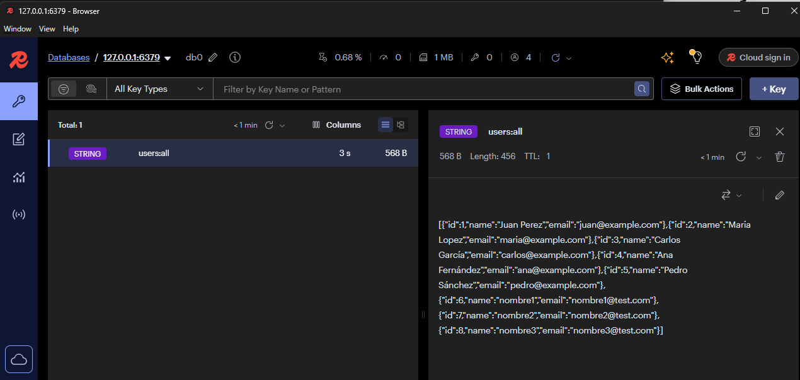
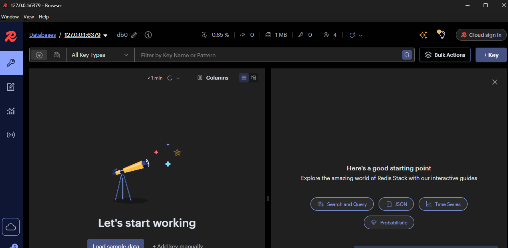

> **Persistencia de Datos**
```bash
# Crear datos
curl -X POST ...
```
```bash

# Detener servicios
docker compose down
```


```bash

# Levantar de nuevo
docker compose up -d
```

```bash

# Verificar que datos persisten
curl http://localhost:8080/api/products
```
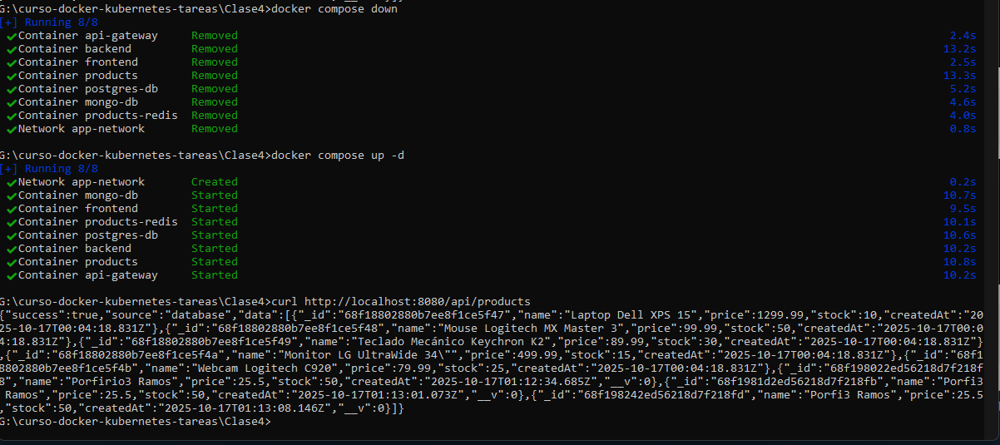

> **Gateway Routing**
```bash
# Verificar que gateway rutea correctamente
curl http://localhost:8080/gateway/health
curl http://localhost:8080/api/health
curl http://localhost:8080/  # Debe mostrar frontend
```
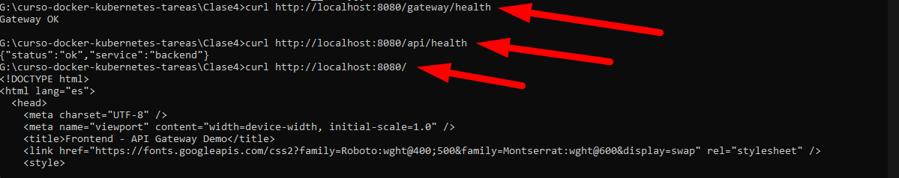
**FRONTEND**
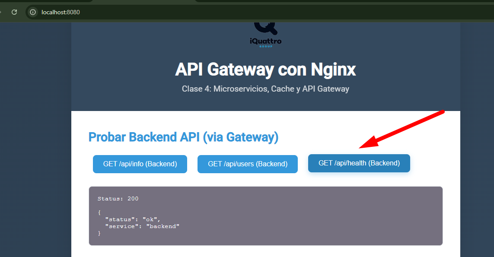
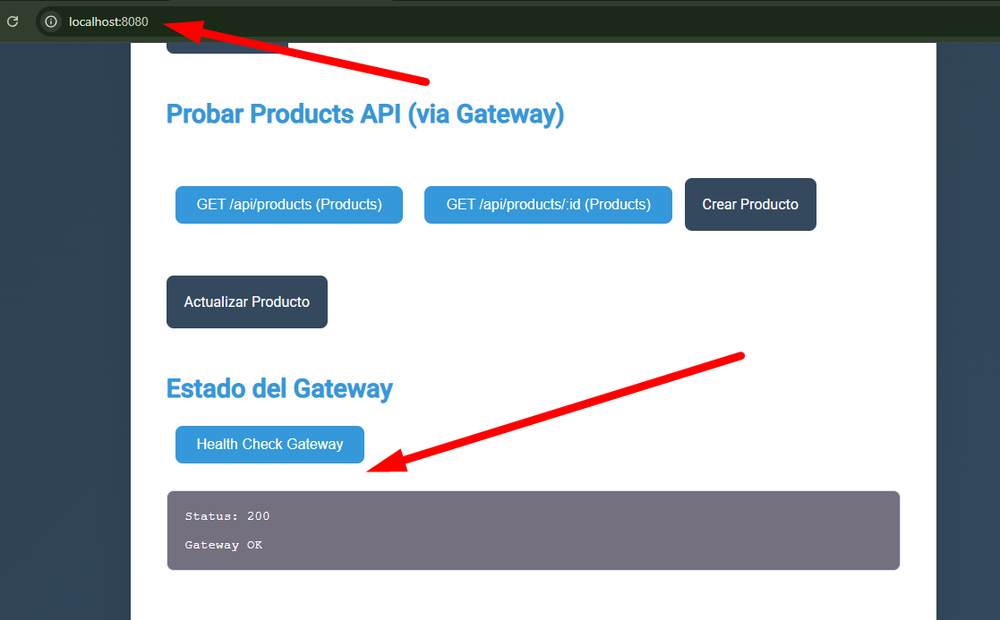
## <mark>🔥 6. Capturas de Pantalla</mark>
Incluye mínimo:

Frontend funcionando
### * Resultado de docker compose ps
```bash
docker compose ps
```

### * Logs mostrando conexión a Redis y MongoDB
```bash
docker logs products
```

### * Logs mostrando conexión a Redis y PostgreSql
```bash
docker logs backend
```

### * Respuesta de API con "source": "cache" Servicio Backend y BD PostgresSQL

**POSTMAN**
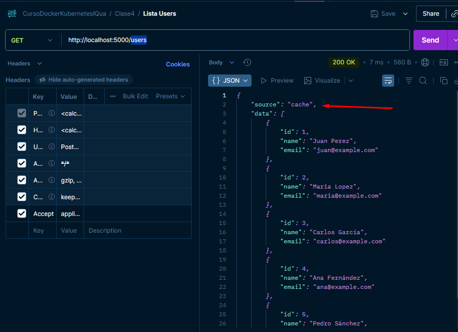
### * Respuesta de API con "source": "database" Servicio Backend y BD PostgresSQL

**POSTMAN**
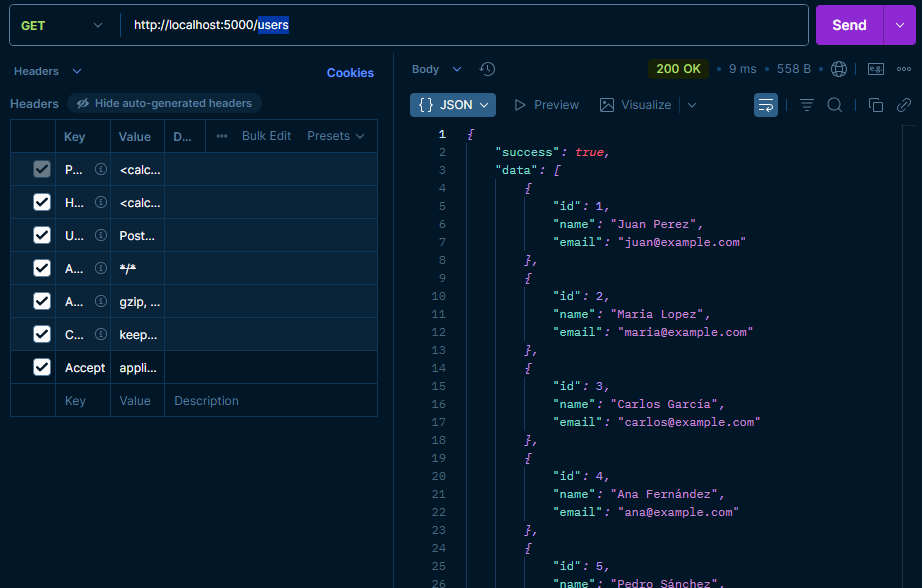
### * Respuesta de API con "source": "cache" Servicio Products y BD MongoDB
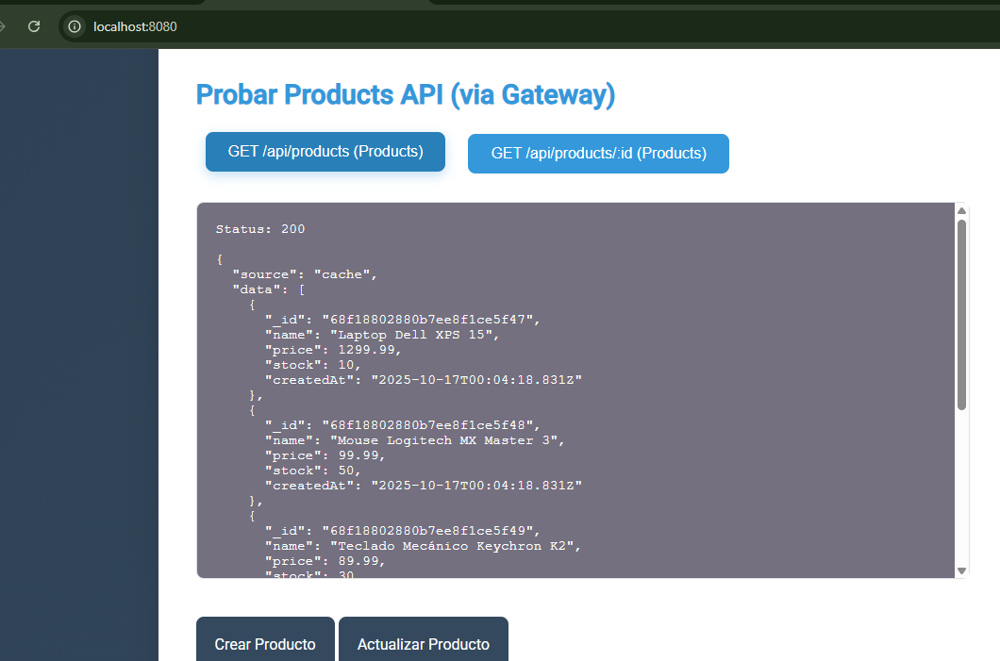
**POSTMAN**
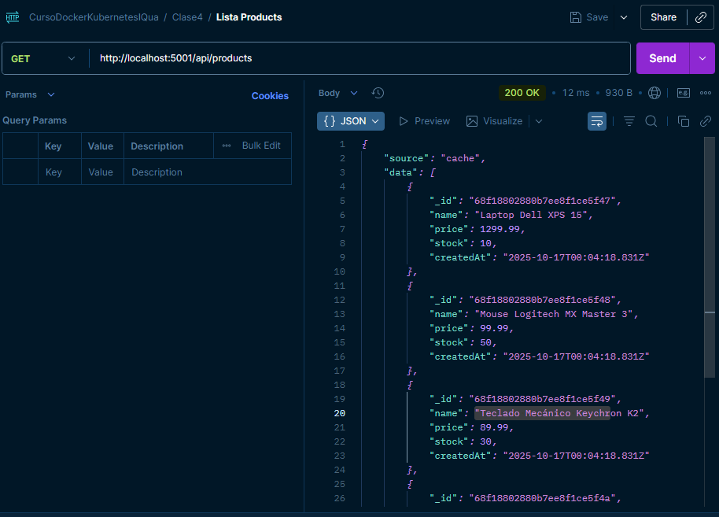
### * Respuesta de API con "source": "database" Servicio Products y BD MongoDB
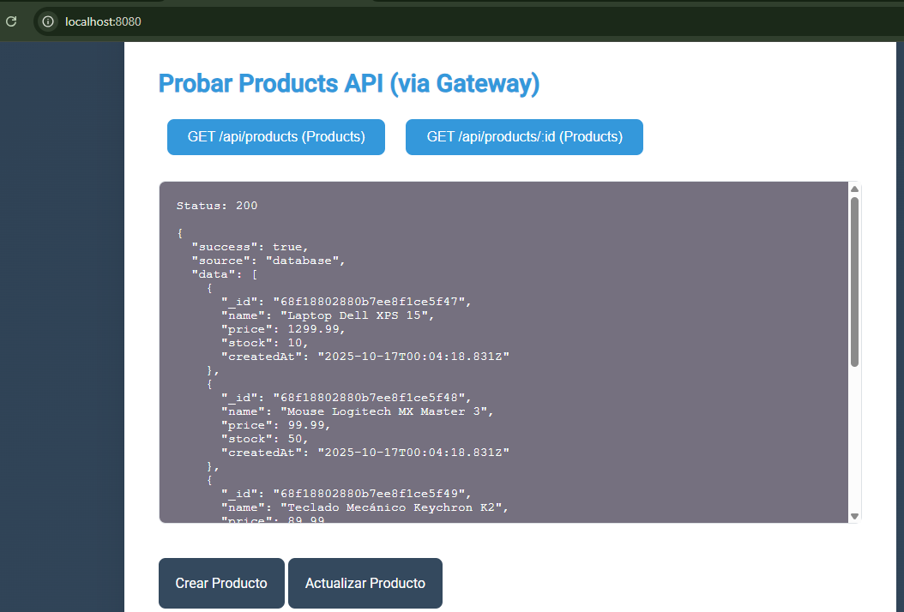
**POSTMAN**
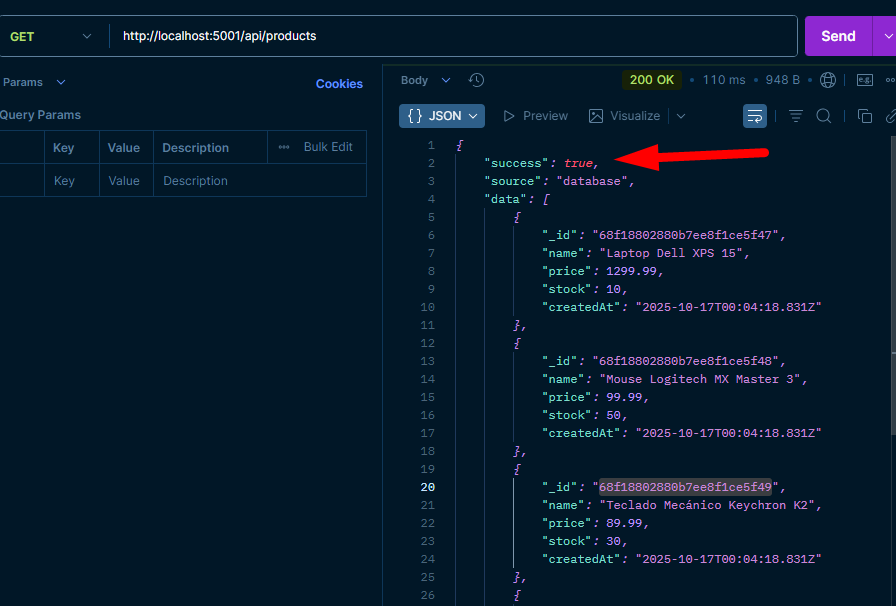


