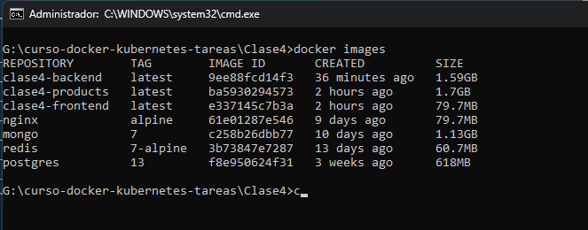
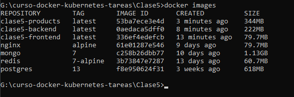
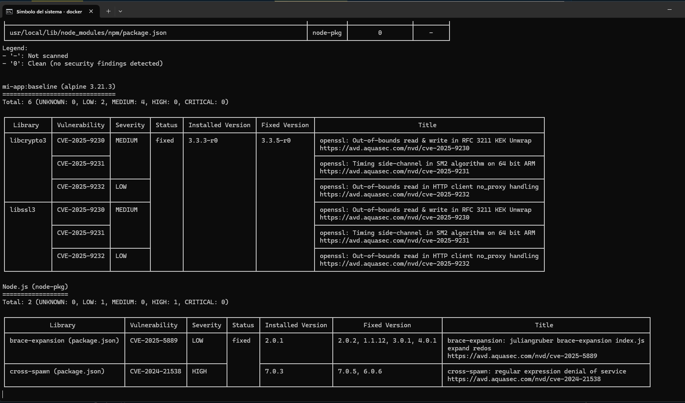
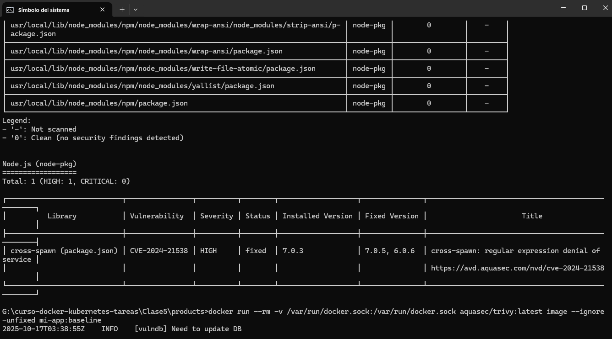
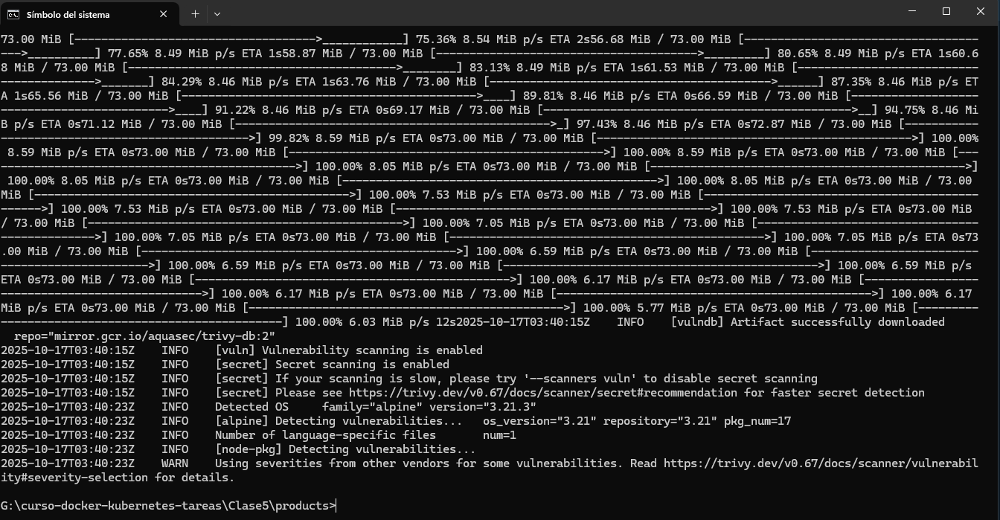

# Tarea 5 - Seguridad y Optimización de Imágenes

> 🎯 Objetivo

Aplicar técnicas de seguridad y optimización a una aplicación real, escaneándola con Trivy y mejorando su Dockerfile.
## <mark>🔥 1. Título y Descripción</mark>
 👉 **Nombre del proyecto:** Optimizar Tarea 4
 👉 **Descripción de la aplicación:**
 Cliente se conecta al servicio api-gateway al puerto :8080 y este api-gateway es quien direcciona al servicio backend que esta en el puerto 5000 que se conecta a la base de datos postgres o direcciona al servicio products  que esta en el puerto 5001 que se conecta la base de datos mongodb. 
* **Lista todos los productos y usuarios**
* **Muestra productos y usuarios por id,**
* **Crea productos y usuarios**
* **Actualiza productos y usuarios**
 👉 **Objetivo de optimización:**
## <mark>🔥 2. Tecnologías Utilizadas</mark>


```markdown

- Node.js 18 (alpine)
- Nginx (alpine)
- MongoDB 7
- Postgres 13
- Redis 7
- Docker & Docker Compose
- Trivy para escaneo de seguridad
```

## <mark>🔥 3. Mejoras Aplicadas</mark>
## Mejoras de Seguridad y Optimización

### 3.1. Multi-Stage Build
- **Antes**: Imagen única con herramientas de build
- **Después**: Build separado, solo archivos necesarios en producción
- **Beneficio**: Reducción de ~800MB

### 3.2. Imagen Base Alpine
- **Antes**: node:18 (1.1GB)
- **Después**: node:18-alpine (150MB)
- **Beneficio**: -85% tamaño, menos vulnerabilidades

### 3.3. Usuario Non-Root
- **Antes**: Ejecuta como root (riesgo de seguridad)
- **Después**: Usuario appuser (UID 1001)
- **Beneficio**: Previene escalación de privilegios

### 3.4. Health Check
- **Implementación**: Verificación cada 30s
- **Beneficio**: Docker detecta containers no saludables

### 3.5. Labels de Seguridad
- **Implementación**: Metadata en imagen
- **Beneficio**: Trazabilidad y auditoría

## <mark>🔥 4. Tabla Comparativa</mark>

Crea una tabla comparativa en tu README.md:

| Métrica                   | Baseline | Optimizado | Mejora |
|---------                  |----------|------------|--------|
| Tamaño imagen             | 1.7GB    | 344MB      | -80% |
| Vulnerabilidades CRITICAL |         | 0          | -100% |
| Vulnerabilidades HIGH     |        | 1          | -% |
| Usuario                   | root     | appuser    | ✓     |
| Multi-stage               | ✗        | ✓         | ✓     |
| Health check              | ✗       | ✓          | ✓     |

## <mark>🔥 5. Análisis de Vulnerabilidades</mark>
## Análisis de Vulnerabilidades

### Vulnerabilidades Críticas Resueltas

1. **CVE-2024-21538** - Vulnerability en cross-spawn (package.json) 
   - Severidad: HIGH
   - Fix: Actualización 7.0.5, 6.0.6

## <mark>🔥 6. Instrucciones de Uso</mark>
```bash
# Clonar repositorio
git clone https://github.com/aguila777develop/curso-docker-kubernetes-tareas.git

# Levantar servicios
cd curso-docker-kubernetes-tareas
cd Clase5

# Construir imagen optimizada
docker build -t mi-app:optimizado .

# Escanear con Trivy
trivy image mi-app:optimizado


```

## <mark>🔥 6. Verificación de Seguridad</mark>
Checklist que puedes copiar:
```markdown
## Checklist de Seguridad

- [x] Escaneo con Trivy (0 CRITICAL)
- [x] Usuario non-root verificado
- [x] Multi-stage build implementado
- [x] Imagen base alpine utilizada
- [x] Health check funcional
- [ ] Labels de metadata agregados
- [ ] .dockerignore configurado
- [x] Sin secretos hardcoded en código
```






---
