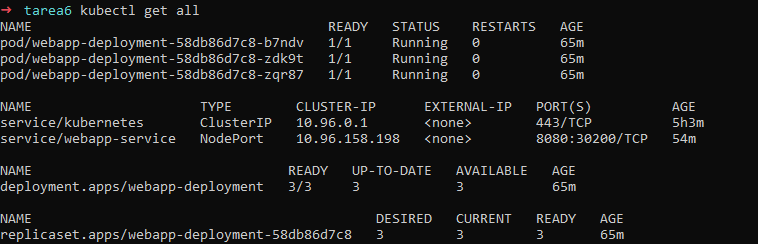
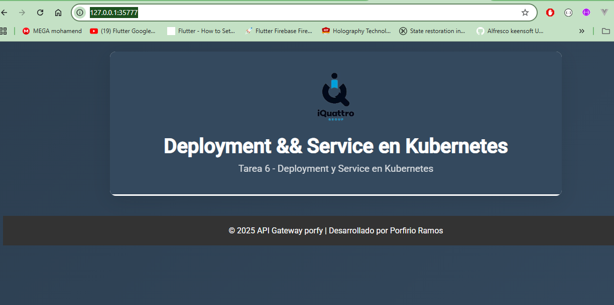
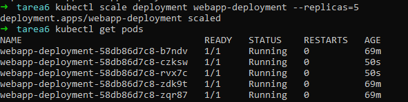
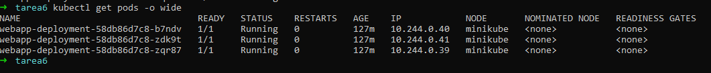
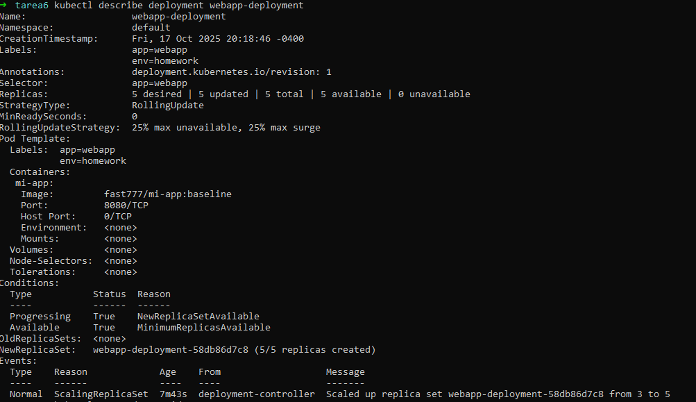
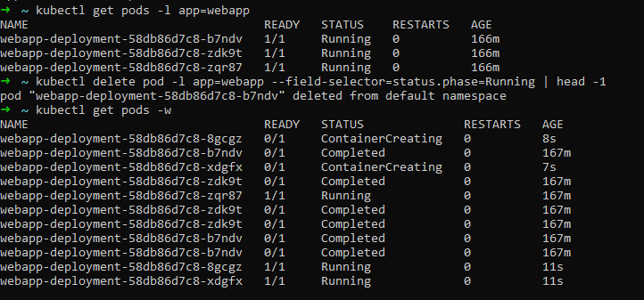
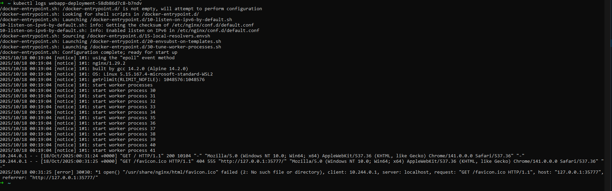

# Tarea 6 - Deployment y Service en Kubernetes

> 🎯 Objetivo

Practicar la creación de Deployments y Services desplegando una aplicación web en Kubernetes, aplicando los conceptos de réplicas, labels, selectors y exposición de servicios aprendidos en clase.

## <mark> 🔥 1. Encabezado</mark>

👉 **Curso:** Docker & Kubernetes - Clase 6
👉 **Estudiante:** Porfirio Ramos Fernandez
👉 **Breve descripción:** 
Solo es una aplicacion web, que esta alojada en docker Hub y que muestra una página personalizada en html.


## <mark> 🔥 2. Tecnologías utilizadas</mark>

- **Aplicación:** Nginx (alpine)
- **Kubernetes:** minikube/ NodePort /YAML
- **Réplicas:** 3

## <mark>🔥 3. Cómo Ejecutar</mark>
> <h4> 🛠 1. Clonar:</h4>
```bash
# Clonar repositorio
git clone https://github.com/aguila777develop/curso-docker-kubernetes-tareas.git

cd curso-docker-kubernetes-tareas
cd Clase6
```
> <h4> 🛠 2. Desplegar:</h4>
```bash
kubectl apply -f deployment.yaml

# respuesta en la consola
deployment.apps/webapp-deployment created
```

```bash
kubectl apply -f service.yaml

# respuesta en la consola
service/webapp-service created
```

> <h4> 🛠 3. Acceder:</h4>
solicitar una url:
```bash
 minikube service webapp-service --url
# respuesta en la consola
http://127.0.0.1:35777
❗  Because you are using a Docker driver on linux, the terminal needs to be open to run it.
```
## <mark>🔥 4. Cómo Probar:</mark>
##### 🚀 Verificación
> **4.1. Ver recursos:**
```bash

kubectl get all
# respuesta en la consola
NAME                                     READY   STATUS    RESTARTS   AGE
pod/webapp-deployment-58db86d7c8-b7ndv   1/1     Running   0          65m
pod/webapp-deployment-58db86d7c8-zdk9t   1/1     Running   0          65m
pod/webapp-deployment-58db86d7c8-zqr87   1/1     Running   0          65m

NAME                     TYPE        CLUSTER-IP      EXTERNAL-IP   PORT(S)          AGE
service/kubernetes       ClusterIP   10.96.0.1       <none>        443/TCP          5h3m
service/webapp-service   NodePort    10.96.158.198   <none>        8080:30200/TCP   54m

NAME                                READY   UP-TO-DATE   AVAILABLE   AGE
deployment.apps/webapp-deployment   3/3     3            3           65m

NAME                                           DESIRED   CURRENT   READY   AGE
replicaset.apps/webapp-deployment-58db86d7c8   3         3         3       65m
```
> **4.2. Acceder a la web**
 
 http://127.0.0.1:35777/

> **4.3. Escalar:**
```bash
kubectl scale deployment webapp-deployment --replicas=5
# respuesta en la consola
deployment.apps/webapp-deployment scaled
```
```bash
kubectl get pods
# respuesta en la consola
NAME                                 READY   STATUS    RESTARTS   AGE
webapp-deployment-58db86d7c8-b7ndv   1/1     Running   0          69m
webapp-deployment-58db86d7c8-czksw   1/1     Running   0          50s
webapp-deployment-58db86d7c8-rvx7c   1/1     Running   0          50s
webapp-deployment-58db86d7c8-zdk9t   1/1     Running   0          69m
webapp-deployment-58db86d7c8-zqr87   1/1     Running   0          69m
```
## <mark>🔥 5. Capturas de Pantalla:</mark>
## Screenshots
### Recursos desplegados
```bash
kubectl get all
```

### Aplicación funcionando
web app url:  http://127.0.0.1:35777/

### Escalado a 5 réplicas
```bash
kubectl scale deployment webapp-deployment --replicas=5
kubectl get pods
```

## <mark>🔥 6. Conceptos Aplicados:</mark>
- **Deployment con 3 réplicas:** Es un recurso que gestiona el ciclo de vida de las aplicaciones y garantiza que siempre haya un número deseado de réplicas de un contenedor en ejecución.
- **Service tipo NodePort:** Es una forma de exponer un servicio de un contenedor (o un conjunto de contenedores) a través de un puerto accesible desde fuera del clúster. Esto es útil cuando quieres que tu aplicación sea accesible desde fuera del entorno de Kubernetes, pero sin necesidad de un balanceador de carga o un servicio de tipo LoadBalance.
- **Labels y selectors:** Son conceptos fundamentales que permiten organizar y gestionar los recursos de manera eficiente.
- **Auto-healing:** Se refiere a la capacidad del sistema para detectar y reparar automáticamente los fallos de los recursos dentro del clúster, como pods, contenedores o nodos. El auto-healing asegura que los servicios sigan funcionando sin interrupciones, incluso cuando ocurren fallos en los componentes del sistema.
- **Escalado horizontal:** Es una técnica que permite aumentar o disminuir el número de réplicas de un pod (es decir, instancias del contenedor) en función de la carga o la demanda de la aplicación.
## <mark>🔥 7. Capturas de Pantalla:</mark>

> <h4> 🛠 1. Recursos desplegados:<h4>
 kubectl get all mostrando deployment, pods y service 

> <h4> 🛠 2. Pods detallados:<h4>
kubectl get pods -o wide con las 3 réplicas running

> <h4> 🛠 3. Aplicación funcionando:<h4>
 Navegador accediendo a http://127.0.0.1:35777/


> <h4> 🛠 4. Escalado:<h4>
kubectl get pods después de escalar a 5 réplicas


> <h4> 🛠 Opcional:</h4>


* **kubectl describe deployment webapp-deployment**

* **Auto-healing después de eliminar un pod**
```bash
kubectl get pods -l app=webapp
kubectl delete pod -l app=webapp --field-selector=status.phase=Running | head -1
kubectl get pods -w
```

* **Logs de uno de los pods**
