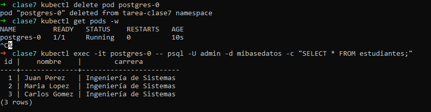

# Tarea - Clase 7

Nota importante: Esta tarea se enfoca en los conceptos de Kubernetes, NO en desarrollo de aplicaciones. Usarás imágenes pre-construidas.

## <mark>🔥 a) Descripción:</mark>

> 🎯 Objetivo de la tarea

Aplicar los conceptos de Namespaces, ConfigMaps, Secrets y StatefulSets desplegando PostgreSQL con persistencia en Kubernetes.
> 🎯 Conceptos aplicados

👉 **namespace:** Es una forma de organizar y gestionar los recursos dentro de un clúster de manera lógica, permitiendo que varios usuarios o equipos trabajen en el mismo clúster sin interferir entre sí. Los Namespaces proporcionan un mecanismo para dividir un clúster en partes virtuales, lo que permite un mejor aislamiento y control sobre los recursos, especialmente en entornos con múltiples aplicaciones o equipos.
👉 **configmap:** Es un objeto que permite almacenar datos de configuración en forma de pares clave-valor. Los ConfigMaps se utilizan para separar la configuración de la aplicación de su código fuente, lo que permite modificar la configuración sin tener que reconstruir o redeplegar los contenedores. Esto es útil para cambiar configuraciones en tiempo de ejecución sin afectar a los recursos del clúster o la propia aplicación.
👉 **secret:** Es un objeto que almacena información confidencial, como contraseñas, claves API, certificados SSL, tokens de acceso, o cualquier otro tipo de dato sensible. Los Secrets permiten almacenar estos valores de forma más segura que en un ConfigMap, ya que Kubernetes proporciona ciertas protecciones y encriptación para manejar estos datos de manera más segura dentro del clúster.
👉 **statefulset:** Es un tipo de controller que gestiona el despliegue y la escalabilidad de un conjunto de pods, con la diferencia principal de que, a diferencia de los Deployments, los pods gestionados por un StatefulSet tienen identidad persistente. Esto significa que cada pod en un StatefulSet tiene un nombre único y persistente, y puede mantener el estado entre reinicios, lo que es crucial para aplicaciones con estado (como bases de datos o aplicaciones que requieren un almacenamiento persistente).
👉 **pvc:** Es una solicitud de almacenamiento persistente por parte de un pod. Actúa como una abstracción que permite a los pods acceder a volúmenes persistentes (PersistentVolumes o PV) sin tener que preocuparse por la infraestructura subyacente. El PVC es la forma en que un pod solicita un volumen de almacenamiento en Kubernetes, y Kubernetes se encarga de asociar este PVC con un volumen físico de almacenamiento (un PersistentVolume).

## <mark>🔥 b) Instrucciones paso a paso:</mark>
👉 **Crear namespace**

```bash
# creamos el archivo
cat > namespace.yaml <<EOF
apiVersion: v1
kind: Namespace
metadata:
  name: tarea-clase7
  labels:
    proyecto: tarea
    clase: clase7
EOF
```

```bash
kubectl config set-context --current --namespace=tarea-clase7
```

👉 **Aplicar ConfigMap**
👉 **Aplicar Secret**
```bash
# creamos el archivo
cat > secret.yaml <<EOF
apiVersion: v1
kind: Secret
metadata:
  name: postgres-secret
  namespace: tarea-clase7
type: Opaque
stringData:
  POSTGRES_USER: admin
  POSTGRES_PASSWORD: mip455word
EOF
```
👉 **Aplicar Headless Service**
👉 **Aplicar StatefulSet**
👉 **Verificar que todo está corriendo**
👉 **Probar PostgreSQL**
👉 **Demostrar persistencia**

## <mark>🔥 c) Comandos de verificación:</mark>

```bash
kubectl get all -n tarea-clase7
```
```bash
kubectl get pvc -n tarea-clase7
```
```bash
kubectl get configmap,secret -n tarea-clase7
```
> ### 🚀 Comandos ejecutados
```bash
➜  clase7 cat > namespace.yaml <<EOF
apiVersion: v1
kind: Namespace
metadata:
  name: tarea-clase7
  labels:
    proyecto: tarea
    clase: clase7
EOF
➜  clase7 ls
namespace.yaml
➜  clase7 kubectl config set-context --current --namespace=tarea-clase7
Context "minikube" modified.
➜  clase7 kubectl config view --minify | grep namespace:
    namespace: tarea-clase7
➜  clase7 cat > configmap.yaml <<EOF
apiVersion: v1
kind: ConfigMap
metadata:
  name: postgres-config
  namespace: tarea-clase7
data:
  POSTGRES_DB: mibasedatos
  PGDATA: /var/lib/postgresql/data/pgdata
EOF
➜  clase7 kubectl get configmap postgres-config -o yaml
Error from server (NotFound): namespaces "tarea-clase7" not found
➜  clase7 kubectl get namespaces

NAME                   STATUS   AGE
default                Active   7h7m
kube-node-lease        Active   7h7m
kube-public            Active   7h7m
kube-system            Active   7h7m
kubernetes-dashboard   Active   6h56m
➜  clase7 kubectl create namespace tarea-clase7
namespace/tarea-clase7 created
➜  clase7 kubectl get namespaces

NAME                   STATUS   AGE
default                Active   7h7m
kube-node-lease        Active   7h7m
kube-public            Active   7h7m
kube-system            Active   7h7m
kubernetes-dashboard   Active   6h57m
tarea-clase7           Active   7s
➜  clase7 kubectl get configmap postgres-config -o yaml
Error from server (NotFound): configmaps "postgres-config" not found
➜  clase7 kubectl get configmap postgres-config -o yaml --namespace=tarea-clase7
Error from server (NotFound): configmaps "postgres-config" not found
➜  clase7 ls
configmap.yaml  namespace.yaml
➜  clase7 kubectl apply -f configmap.yaml
configmap/postgres-config created
➜  clase7 kubectl get configmap postgres-config -o yaml
apiVersion: v1
data:
  PGDATA: /var/lib/postgresql/data/pgdata
  POSTGRES_DB: mibasedatos
kind: ConfigMap
metadata:
  annotations:
    kubectl.kubernetes.io/last-applied-configuration: |
      {"apiVersion":"v1","data":{"PGDATA":"/var/lib/postgresql/data/pgdata","POSTGRES_DB":"mibasedatos"},"kind":"ConfigMap","metadata":{"annotations":{},"name":"postgres-config","namespace":"tarea-clase7"}}
  creationTimestamp: "2025-10-18T03:29:56Z"
  name: postgres-config
  namespace: tarea-clase7
  resourceVersion: "22525"
  uid: b78e9050-623e-4b8c-8115-77a6ed6409e6
➜  clase7 cat > configmap.yaml <<EOF
apiVersion: v1
kind: Secret
metadata:
  name: postgres-secret
  namespace: tarea-clase7
type: Opaque
stringData:
  POSTGRES_USER: admin
  POSTGRES_PASSWORD: mip455word
EOF
➜  clase7 ls
configmap.yaml  namespace.yaml
➜  clase7 cat > configmap.yaml <<EOF
apiVersion: v1
kind: ConfigMap
metadata:
  name: postgres-config
  namespace: tarea-clase7
data:
  POSTGRES_DB: mibasedatos
  PGDATA: /var/lib/postgresql/data/pgdata
EOF
➜  clase7 kubectl get configmap postgres-config -o yaml
apiVersion: v1
data:
  PGDATA: /var/lib/postgresql/data/pgdata
  POSTGRES_DB: mibasedatos
kind: ConfigMap
metadata:
  annotations:
    kubectl.kubernetes.io/last-applied-configuration: |
      {"apiVersion":"v1","data":{"PGDATA":"/var/lib/postgresql/data/pgdata","POSTGRES_DB":"mibasedatos"},"kind":"ConfigMap","metadata":{"annotations":{},"name":"postgres-config","namespace":"tarea-clase7"}}
  creationTimestamp: "2025-10-18T03:29:56Z"
  name: postgres-config
  namespace: tarea-clase7
  resourceVersion: "22525"
  uid: b78e9050-623e-4b8c-8115-77a6ed6409e6
➜  clase7 cat > secret.yaml <<EOF
apiVersion: v1
kind: Secret
metadata:
  name: postgres-secret
  namespace: tarea-clase7
type: Opaque
stringData:
  POSTGRES_USER: admin
  POSTGRES_PASSWORD: mip455word
EOF
➜  clase7 ls
configmap.yaml  namespace.yaml  secret.yaml
➜  clase7 kubectl apply -f secret.yaml
secret/postgres-secret created
➜  clase7 kubectl get secret postgres-secret
NAME              TYPE     DATA   AGE
postgres-secret   Opaque   2      30s
➜  clase7 kubectl describe secret postgres-secret
Name:         postgres-secret
Namespace:    tarea-clase7
Labels:       <none>
Annotations:  <none>

Type:  Opaque

Data
====
POSTGRES_PASSWORD:  10 bytes
POSTGRES_USER:      5 bytes
➜  clase7 cat > postgres-headless.yaml <<EOF
apiVersion: v1
kind: Service
metadata:
  name: postgres-headless
  namespace: tarea-clase7
spec:
  clusterIP: None
  selector:
    app: postgres
  ports:
  - port: 5432
    targetPort: 5432
    name: postgres
EOF
➜  clase7 ls
configmap.yaml  namespace.yaml  postgres-headless.yaml  secret.yaml
➜  clase7 kubectl apply -f postgres-headless.yaml
Warning: spec.SessionAffinity is ignored for headless services
service/postgres-headless created
➜  clase7 kubectl get service postgres-headless
NAME                TYPE        CLUSTER-IP   EXTERNAL-IP   PORT(S)    AGE
postgres-headless   ClusterIP   None         <none>        5432/TCP   14s
➜  clase7 cat > postgres-statefulset.yaml <<EOF
apiVersion: apps/v1
kind: StatefulSet
metadata:
  name: postgres
  namespace: tarea-clase7
spec:
  serviceName: postgres-headless
  replicas: 1
  selector:
    matchLabels:
      app: postgres
  template:
    metadata:
      labels:
        app: postgres
    spec:
      containers:
      - name: postgres
        image: postgres:15-alpine
        ports:
        - containerPort: 5432
          name: postgres
        envFrom:
        - configMapRef:
            name: postgres-config
        - secretRef:
            name: postgres-secret
        volumeMounts:
        - name: postgres-storage
          mountPath: /var/lib/postgresql/data
  volumeClaimTemplates:
  - metadata:
      name: postgres-storage
    spec:
      accessModes: ["ReadWriteOnce"]
      resources:
        requests:
          storage: 1Gi
EOF
➜  clase7 ls
configmap.yaml  namespace.yaml  postgres-headless.yaml  postgres-statefulset.yaml  secret.yaml
➜  clase7 kubectl apply -f postgres-statefulset.yaml
statefulset.apps/postgres created
➜  clase7 kubectl get statefulset postgres
NAME       READY   AGE
postgres   0/1     11s
➜  clase7 kubectl get pods -l app=postgres
NAME         READY   STATUS              RESTARTS   AGE
postgres-0   0/1     ContainerCreating   0          21s
➜  clase7 kubectl get pvc
NAME                          STATUS   VOLUME                                     CAPACITY   ACCESS MODES   STORAGECLASS   VOLUMEATTRIBUTESCLASS   AGE
postgres-storage-postgres-0   Bound    pvc-2df89b49-7af7-4966-afa4-12743bb1ff8d   1Gi        RWO            standard       <unset>                 36s
➜  clase7 kubectl exec -it postgres-0 -- psql -U admin -d mibasedatos
psql (15.14)
Type "help" for help.

mibasedatos=# CREATE TABLE estudiantes (
mibasedatos(#     id SERIAL PRIMARY KEY,
mibasedatos(#     nombre VARCHAR(100),
mibasedatos(#     carrera VARCHAR(100)
mibasedatos(# );
 estudiantes (nombre, carrera) VALUES
    ('Juan Perez', 'Ingeniería de Sistemas'),
    ('Maria Lopez', 'Ingeniería de Sistemas'),
    ('Carlos Gomez', 'Ingeniería de Sistemas');

SELECT * FROM estudiantes;CREATE TABLE
mibasedatos=#
mibasedatos=# INSERT INTO estudiantes (nombre, carrera) VALUES
mibasedatos-#     ('Juan Perez', 'Ingeniería de Sistemas'),
mibasedatos-#     ('Maria Lopez', 'Ingeniería de Sistemas'),
mibasedatos-#     ('Carlos Gomez', 'Ingeniería de Sistemas');
INSERT 0 3
mibasedatos=#
mibasedatos=# SELECT * FROM estudiantes;
 id |    nombre    |        carrera
----+--------------+------------------------
  1 | Juan Perez   | Ingeniería de Sistemas
  2 | Maria Lopez  | Ingeniería de Sistemas
  3 | Carlos Gomez | Ingeniería de Sistemas
(3 rows)

mibasedatos=# \q
➜  clase7 kubectl delete pod postgres-0
pod "postgres-0" deleted from tarea-clase7 namespace
➜  clase7 kubectl get pods -w
NAME         READY   STATUS    RESTARTS   AGE
postgres-0   1/1     Running   0          10s
^C%                                                                                                                                                                                                                                          ➜  clase7 kubectl exec -it postgres-0 -- psql -U admin -d mibasedatos -c "SELECT * FROM estudiantes;"
 id |    nombre    |        carrera
----+--------------+------------------------
  1 | Juan Perez   | Ingeniería de Sistemas
  2 | Maria Lopez  | Ingeniería de Sistemas
  3 | Carlos Gomez | Ingeniería de Sistemas
(3 rows)

➜  clase7 kubectl get all
NAME             READY   STATUS    RESTARTS   AGE
pod/postgres-0   1/1     Running   0          7m46s

NAME                        TYPE        CLUSTER-IP   EXTERNAL-IP   PORT(S)    AGE
service/postgres-headless   ClusterIP   None         <none>        5432/TCP   11m

NAME                        READY   AGE
statefulset.apps/postgres   1/1     9m30s
➜  clase7 kubectl get pvc
NAME                          STATUS   VOLUME                                     CAPACITY   ACCESS MODES   STORAGECLASS   VOLUMEATTRIBUTESCLASS   AGE
postgres-storage-postgres-0   Bound    pvc-2df89b49-7af7-4966-afa4-12743bb1ff8d   1Gi        RWO            standard       <unset>                 11m
➜  clase7 
```
## <mark>🔥 d) Capturas de pantalla:</mark>

👉 **kubectl get all mostrando todos los recursos**

👉 **kubectl get pvc mostrando el volumen BOUND**

👉 **Datos en PostgreSQL (SELECT)**

👉 **Prueba de persistencia (después de eliminar pod)**


## <mark>🔥 e) Comandos de limpieza:</mark>
> **Eliminar todos los recursos**
```bash
kubectl delete namespace tarea-clase7
# Esto elimina todo: pods, services, configmaps, secrets, pvcs
```
> **Verificar**
```bash
kubectl get namespaces | grep tarea-clase7

```
```bash

kubectl get pvc --all-namespaces | grep tarea-clase7
```


