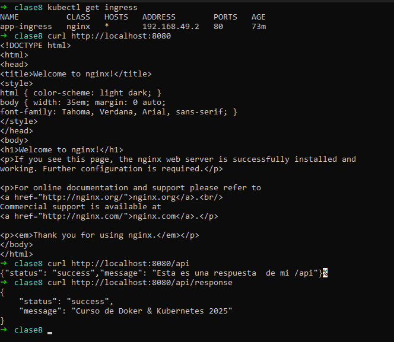
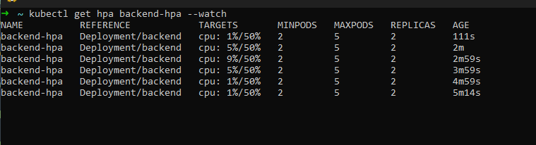
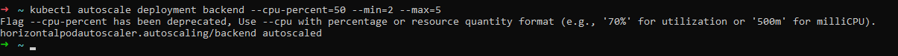

# Tarea 8


## <mark> 🔥 a) Descripción del proyecto:</mark>
- **Stack desplegado (frontend + backend)**
- **Conceptos aplicados (Ingress, health probes, HPA)**
**Ingress:** El Ingress es el puente entre el mundo externo y tus servicios dentro del clúster.
Permite que los usuarios accedan a tus aplicaciones (frontend, backend, APIs, etc.) usando rutas HTTP o HTTPS.
**HPA:** El HPA (Horizontal Pod Autoscaler) ajusta automáticamente el número de réplicas de un Deployment según la carga (CPU, memoria, etc.).
**Health probes:** Las probes son chequeos automáticos que hace Kubernetes para saber si un contenedor está sano o no.
Hay dos tipos principales:

  * Liveness Probe: verifica si el contenedor sigue vivo. Si falla → Kubernetes lo reinicia.

  * Readiness Probe: verifica si el contenedor está listo para recibir tráfico. Si falla → no recibe peticiones hasta recuperarse.


## <mark> 🔥 b) Instrucciones de despliegue:</mark>
**1. Habilitar addons (ingress, metrics-server)**
```bash
minikube addons enable ingress
minikube addons enable metrics-server
```
**2. Aplicar manifests**
```bash
kubectl apply -f backend-deployment.yaml
kubectl apply -f backend-service.yaml
kubectl apply -f frontend-deployment.yaml
kubectl apply -f frontend-service.yaml
kubectl apply -f ingress.yaml
kubectl apply -f hpa.yaml

```
**3. Verificar recursos**
```bash
 ~ kubectl get ingress
NAME          CLASS   HOSTS   ADDRESS        PORTS   AGE
app-ingress   nginx   *       192.168.49.2   80      102m
➜  ~ kubectl get hpa
NAME          REFERENCE            TARGETS              MINPODS   MAXPODS   REPLICAS   AGE
backend       Deployment/backend   cpu: <unknown>/50%   2         5         2          11m
backend-hpa   Deployment/backend   cpu: <unknown>/50%   2         5         2          43m
➜  ~ kubectl top pods
NAME                        CPU(cores)   MEMORY(bytes)
backend-6cdb48f4fc-dlb2b    1m           10Mi
backend-6cdb48f4fc-fb7qp    1m           10Mi
frontend-55b84b596d-fvpqx   1m           10Mi
frontend-55b84b596d-r6cgm   1m           10Mi
➜  ~ kubectl get pods -n ingress-nginx
NAME                                       READY   STATUS      RESTARTS   AGE
ingress-nginx-admission-create-t8zp2       0/1     Completed   0          12h
ingress-nginx-admission-patch-h4b7p        0/1     Completed   1          12h
ingress-nginx-controller-9cc49f96f-z528x   1/1     Running     0          12h
➜  ~ kubectl get pods
NAME                        READY   STATUS    RESTARTS   AGE
backend-6cdb48f4fc-dlb2b    1/1     Running   0          75m
backend-6cdb48f4fc-fb7qp    1/1     Running   0          75m
frontend-55b84b596d-fvpqx   1/1     Running   0          127m
frontend-55b84b596d-r6cgm   1/1     Running   0          127m
load-generator              0/1     Error     0          66m
➜  ~ kubectl describe ingress
Name:             app-ingress
Labels:           <none>
Namespace:        default
Address:          192.168.49.2
Ingress Class:    nginx
Default backend:  <default>
Rules:
  Host        Path  Backends
  ----        ----  --------
  *
              /      frontend-service:80 (10.244.0.26:80,10.244.0.27:80)
              /api   backend-service:80 (10.244.0.30:80,10.244.0.31:80)
Annotations:  nginx.ingress.kubernetes.io/rewrite-target: /
Events:       <none>
➜  ~ kubectl get hpa
NAME          REFERENCE            TARGETS              MINPODS   MAXPODS   REPLICAS   AGE
backend       Deployment/backend   cpu: <unknown>/50%   2         5         2          37m
backend-hpa   Deployment/backend   cpu: <unknown>/50%   2         5         2          70m
➜  ~ kubectl get pods -o wide
NAME                        READY   STATUS    RESTARTS   AGE    IP            NODE       NOMINATED NODE   READINESS GATES
backend-6cdb48f4fc-dlb2b    1/1     Running   0          78m    10.244.0.30   minikube   <none>           <none>
backend-6cdb48f4fc-fb7qp    1/1     Running   0          78m    10.244.0.31   minikube   <none>           <none>
frontend-55b84b596d-fvpqx   1/1     Running   0          129m   10.244.0.26   minikube   <none>           <none>
frontend-55b84b596d-r6cgm   1/1     Running   0          129m   10.244.0.27   minikube   <none>           <none>
load-generator              0/1     Error     0          69m    10.244.0.33   minikube   <none>           <none>
➜  ~ kubectl get svc
NAME               TYPE        CLUSTER-IP       EXTERNAL-IP   PORT(S)   AGE
backend-service    ClusterIP   10.101.121.191   <none>        80/TCP    130m
frontend-service   ClusterIP   10.99.58.47      <none>        80/TCP    129m
kubern
```
**4. Probar Ingress**
```bash
~ kubectl get ingress
NAME          CLASS   HOSTS   ADDRESS        PORTS   AGE
app-ingress   nginx   *       192.168.49.2   80      102m
➜  ~ kubectl get hpa
NAME          REFERENCE            TARGETS              MINPODS   MAXPODS   REPLICAS   AGE
backend       Deployment/backend   cpu: <unknown>/50%   2         5         2          11m
backend-hpa   Deployment/backend   cpu: <unknown>/50%   2         5         2          43m
➜  ~ kubectl top pods
NAME                        CPU(cores)   MEMORY(bytes)
backend-6cdb48f4fc-dlb2b    1m           10Mi
backend-6cdb48f4fc-fb7qp    1m           10Mi
frontend-55b84b596d-fvpqx   1m           10Mi
frontend-55b84b596d-r6cgm   1m           10Mi
➜  ~ kubectl get pods -n ingress-nginx
NAME                                       READY   STATUS      RESTARTS   AGE
ingress-nginx-admission-create-t8zp2       0/1     Completed   0          12h
ingress-nginx-admission-patch-h4b7p        0/1     Completed   1          12h
ingress-nginx-controller-9cc49f96f-z528x   1/1     Running     0          12h
➜  ~ kubectl get pods
NAME                        READY   STATUS    RESTARTS   AGE
backend-6cdb48f4fc-dlb2b    1/1     Running   0          75m
backend-6cdb48f4fc-fb7qp    1/1     Running   0          75m
frontend-55b84b596d-fvpqx   1/1     Running   0          127m
frontend-55b84b596d-r6cgm   1/1     Running   0          127m
load-generator              0/1     Error     0          66m
```
**5. Probar HPA con carga**
## <mark> 🔥 c) Comandos de verificación:</mark>
> kubectl get all
```bash
➜  ~ kubectl get all
NAME                            READY   STATUS    RESTARTS   AGE
pod/backend-6cdb48f4fc-dlb2b    1/1     Running   0          50m
pod/backend-6cdb48f4fc-fb7qp    1/1     Running   0          50m
pod/frontend-55b84b596d-fvpqx   1/1     Running   0          102m
pod/frontend-55b84b596d-r6cgm   1/1     Running   0          102m
pod/load-generator              0/1     Error     0          41m

NAME                       TYPE        CLUSTER-IP       EXTERNAL-IP   PORT(S)   AGE
service/backend-service    ClusterIP   10.101.121.191   <none>        80/TCP    102m
service/frontend-service   ClusterIP   10.99.58.47      <none>        80/TCP    101m
service/kubernetes         ClusterIP   10.96.0.1        <none>        443/TCP   12h

NAME                       READY   UP-TO-DATE   AVAILABLE   AGE
deployment.apps/backend    2/2     2            2           102m
deployment.apps/frontend   2/2     2            2           102m

NAME                                  DESIRED   CURRENT   READY   AGE
replicaset.apps/backend-6866d6848b    0         0         0       75m
replicaset.apps/backend-6cb44856b8    0         0         0       102m
replicaset.apps/backend-6cdb48f4fc    2         2         2       50m
replicaset.apps/frontend-55b84b596d   2         2         2       102m

NAME                                              REFERENCE            TARGETS              MINPODS   MAXPODS   REPLICAS   AGE
horizontalpodautoscaler.autoscaling/backend       Deployment/backend   cpu: <unknown>/50%   2         5         2          9m58s
horizontalpodautoscaler.autoscaling/backend-hpa   Deployment/backend   cpu: <unknown>/50%   2         5         2          42m
```
> kubectl get ingress
```bash
kubectl get ingress
NAME          CLASS   HOSTS   ADDRESS        PORTS   AGE
app-ingress   nginx   *       192.168.49.2   80      102m
```
> kubectl get hpa
```bash
  ~ kubectl get hpa
NAME          REFERENCE            TARGETS              MINPODS   MAXPODS   REPLICAS   AGE
backend       Deployment/backend   cpu: <unknown>/50%   2         5         2          11m
backend-hpa   Deployment/backend   cpu: <unknown>/50%   2         5         2          43m
➜  ~  
```
> kubectl top pods
```bash
➜  ~ kubectl get hpa
NAME          REFERENCE            TARGETS              MINPODS   MAXPODS   REPLICAS   AGE
backend       Deployment/backend   cpu: <unknown>/50%   2         5         2          11m
backend-hpa   Deployment/backend   cpu: <unknown>/50%   2         5         2          43m
➜  ~ kubectl top pods
NAME                        CPU(cores)   MEMORY(bytes)
backend-6cdb48f4fc-dlb2b    1m           10Mi
backend-6cdb48f4fc-fb7qp    1m           10Mi
frontend-55b84b596d-fvpqx   1m           10Mi
frontend-55b84b596d-r6cgm   1m           10Mi
```
## <mark> 🔥 d) Capturas de pantalla</mark>
**1. Ingress funcionando (curl a `/` y `/api`)**

**2. Health probes configurados (`kubectl describe pod`)**


**3. HPA en reposo (TARGETS 0%/50%)**

**4. HPA escalando bajo carga (TARGETS >50%)**

**5. Pods escalados (de 2 a 4-5)**

## <mark> 🔥 e) Comandos de limpieza:</mark>
```bash
kubectl delete ingress app-ingress
kubectl delete hpa backend-hpa
kubectl delete service frontend-service backend-service
kubectl delete deployment frontend backend
```
> respuesta
```bash
➜  ~ kubectl delete ingress app-ingress
kubectl delete hpa backend-hpa
kubectl delete service frontend-service backend-service
kubectl delete deployment frontend backend
ingress.networking.k8s.io "app-ingress" deleted from default namespace
horizontalpodautoscaler.autoscaling "backend-hpa" deleted from default namespace
service "frontend-service" deleted from default namespace
service "backend-service" deleted from default namespace
deployment.apps "frontend" deleted from default namespace
deployment.apps "backend" deleted from default namespace
```
> comprobando
```bash
➜  ~ kubectl get ingress

No resources found in default namespace.
➜  ~   
```