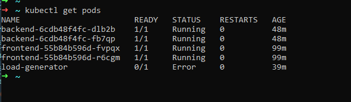

# Tarea 8


## <mark> 🔥 a) Descripción del proyecto:</mark>
- **Stack desplegado (frontend + backend)**
- **Conceptos aplicados (Ingress, health probes, HPA)**
**Ingress:** El Ingress es el puente entre el mundo externo y tus servicios dentro del clúster.
Permite que los usuarios accedan a tus aplicaciones (frontend, backend, APIs, etc.) usando rutas HTTP o HTTPS.
**HPA:** El HPA (Horizontal Pod Autoscaler) ajusta automáticamente el número de réplicas de un Deployment según la carga (CPU, memoria, etc.).
**Health probes:** Las probes son chequeos automáticos que hace Kubernetes para saber si un contenedor está sano o no.
Hay dos tipos principales:

  * Liveness Probe: verifica si el contenedor sigue vivo. Si falla → Kubernetes lo reinicia.

  * Readiness Probe: verifica si el contenedor está listo para recibir tráfico. Si falla → no recibe peticiones hasta recuperarse.


## <mark> 🔥 b) Instrucciones de despliegue:</mark>
**1. Habilitar addons (ingress, metrics-server)**
```bash
minikube addons enable ingress
minikube addons enable metrics-server
```
**2. Aplicar manifests**
```bash
kubectl apply -f backend-deployment.yaml
kubectl apply -f backend-service.yaml
kubectl apply -f frontend-deployment.yaml
kubectl apply -f frontend-service.yaml
kubectl apply -f ingress.yaml
kubectl apply -f hpa.yaml

```
**3. Verificar recursos**
```bash
 ~ kubectl get ingress
NAME          CLASS   HOSTS   ADDRESS        PORTS   AGE
app-ingress   nginx   *       192.168.49.2   80      102m
➜  ~ kubectl get hpa
NAME          REFERENCE            TARGETS              MINPODS   MAXPODS   REPLICAS   AGE
backend       Deployment/backend   cpu: <unknown>/50%   2         5         2          11m
backend-hpa   Deployment/backend   cpu: <unknown>/50%   2         5         2          43m
➜  ~ kubectl top pods
NAME                        CPU(cores)   MEMORY(bytes)
backend-6cdb48f4fc-dlb2b    1m           10Mi
backend-6cdb48f4fc-fb7qp    1m           10Mi
frontend-55b84b596d-fvpqx   1m           10Mi
frontend-55b84b596d-r6cgm   1m           10Mi
➜  ~ kubectl get pods -n ingress-nginx
NAME                                       READY   STATUS      RESTARTS   AGE
ingress-nginx-admission-create-t8zp2       0/1     Completed   0          12h
ingress-nginx-admission-patch-h4b7p        0/1     Completed   1          12h
ingress-nginx-controller-9cc49f96f-z528x   1/1     Running     0          12h
➜  ~ kubectl get pods
NAME                        READY   STATUS    RESTARTS   AGE
backend-6cdb48f4fc-dlb2b    1/1     Running   0          75m
backend-6cdb48f4fc-fb7qp    1/1     Running   0          75m
frontend-55b84b596d-fvpqx   1/1     Running   0          127m
frontend-55b84b596d-r6cgm   1/1     Running   0          127m
load-generator              0/1     Error     0          66m
➜  ~ kubectl describe ingress
Name:             app-ingress
Labels:           <none>
Namespace:        default
Address:          192.168.49.2
Ingress Class:    nginx
Default backend:  <default>
Rules:
  Host        Path  Backends
  ----        ----  --------
  *
              /      frontend-service:80 (10.244.0.26:80,10.244.0.27:80)
              /api   backend-service:80 (10.244.0.30:80,10.244.0.31:80)
Annotations:  nginx.ingress.kubernetes.io/rewrite-target: /
Events:       <none>
➜  ~ kubectl get hpa
NAME          REFERENCE            TARGETS              MINPODS   MAXPODS   REPLICAS   AGE
backend       Deployment/backend   cpu: <unknown>/50%   2         5         2          37m
backend-hpa   Deployment/backend   cpu: <unknown>/50%   2         5         2          70m
➜  ~ kubectl get pods -o wide
NAME                        READY   STATUS    RESTARTS   AGE    IP            NODE       NOMINATED NODE   READINESS GATES
backend-6cdb48f4fc-dlb2b    1/1     Running   0          78m    10.244.0.30   minikube   <none>           <none>
backend-6cdb48f4fc-fb7qp    1/1     Running   0          78m    10.244.0.31   minikube   <none>           <none>
frontend-55b84b596d-fvpqx   1/1     Running   0          129m   10.244.0.26   minikube   <none>           <none>
frontend-55b84b596d-r6cgm   1/1     Running   0          129m   10.244.0.27   minikube   <none>           <none>
load-generator              0/1     Error     0          69m    10.244.0.33   minikube   <none>           <none>
➜  ~ kubectl get svc
NAME               TYPE        CLUSTER-IP       EXTERNAL-IP   PORT(S)   AGE
backend-service    ClusterIP   10.101.121.191   <none>        80/TCP    130m
frontend-service   ClusterIP   10.99.58.47      <none>        80/TCP    129m
kubern
```
**4. Probar Ingress**
```bash
~ kubectl get ingress
NAME          CLASS   HOSTS   ADDRESS        PORTS   AGE
app-ingress   nginx   *       192.168.49.2   80      102m
➜  ~ kubectl get hpa
NAME          REFERENCE            TARGETS              MINPODS   MAXPODS   REPLICAS   AGE
backend       Deployment/backend   cpu: <unknown>/50%   2         5         2          11m
backend-hpa   Deployment/backend   cpu: <unknown>/50%   2         5         2          43m
➜  ~ kubectl top pods
NAME                        CPU(cores)   MEMORY(bytes)
backend-6cdb48f4fc-dlb2b    1m           10Mi
backend-6cdb48f4fc-fb7qp    1m           10Mi
frontend-55b84b596d-fvpqx   1m           10Mi
frontend-55b84b596d-r6cgm   1m           10Mi
➜  ~ kubectl get pods -n ingress-nginx
NAME                                       READY   STATUS      RESTARTS   AGE
ingress-nginx-admission-create-t8zp2       0/1     Completed   0          12h
ingress-nginx-admission-patch-h4b7p        0/1     Completed   1          12h
ingress-nginx-controller-9cc49f96f-z528x   1/1     Running     0          12h
➜  ~ kubectl get pods
NAME                        READY   STATUS    RESTARTS   AGE
backend-6cdb48f4fc-dlb2b    1/1     Running   0          75m
backend-6cdb48f4fc-fb7qp    1/1     Running   0          75m
frontend-55b84b596d-fvpqx   1/1     Running   0          127m
frontend-55b84b596d-r6cgm   1/1     Running   0          127m
load-generator              0/1     Error     0          66m
```
**5. Probar HPA con carga**
## <mark> 🔥 c) Comandos de verificación:</mark>
> kubectl get all
```bash
➜  ~ kubectl get all
NAME                            READY   STATUS    RESTARTS   AGE
pod/backend-6cdb48f4fc-dlb2b    1/1     Running   0          50m
pod/backend-6cdb48f4fc-fb7qp    1/1     Running   0          50m
pod/frontend-55b84b596d-fvpqx   1/1     Running   0          102m
pod/frontend-55b84b596d-r6cgm   1/1     Running   0          102m
pod/load-generator              0/1     Error     0          41m

NAME                       TYPE        CLUSTER-IP       EXTERNAL-IP   PORT(S)   AGE
service/backend-service    ClusterIP   10.101.121.191   <none>        80/TCP    102m
service/frontend-service   ClusterIP   10.99.58.47      <none>        80/TCP    101m
service/kubernetes         ClusterIP   10.96.0.1        <none>        443/TCP   12h

NAME                       READY   UP-TO-DATE   AVAILABLE   AGE
deployment.apps/backend    2/2     2            2           102m
deployment.apps/frontend   2/2     2            2           102m

NAME                                  DESIRED   CURRENT   READY   AGE
replicaset.apps/backend-6866d6848b    0         0         0       75m
replicaset.apps/backend-6cb44856b8    0         0         0       102m
replicaset.apps/backend-6cdb48f4fc    2         2         2       50m
replicaset.apps/frontend-55b84b596d   2         2         2       102m

NAME                                              REFERENCE            TARGETS              MINPODS   MAXPODS   REPLICAS   AGE
horizontalpodautoscaler.autoscaling/backend       Deployment/backend   cpu: <unknown>/50%   2         5         2          9m58s
horizontalpodautoscaler.autoscaling/backend-hpa   Deployment/backend   cpu: <unknown>/50%   2         5         2          42m
```
> kubectl get ingress
```bash
kubectl get ingress
NAME          CLASS   HOSTS   ADDRESS        PORTS   AGE
app-ingress   nginx   *       192.168.49.2   80      102m
```
> kubectl get hpa
```bash
  ~ kubectl get hpa
NAME          REFERENCE            TARGETS              MINPODS   MAXPODS   REPLICAS   AGE
backend       Deployment/backend   cpu: <unknown>/50%   2         5         2          11m
backend-hpa   Deployment/backend   cpu: <unknown>/50%   2         5         2          43m
➜  ~  
```
> kubectl top pods
```bash
➜  ~ kubectl get hpa
NAME          REFERENCE            TARGETS              MINPODS   MAXPODS   REPLICAS   AGE
backend       Deployment/backend   cpu: <unknown>/50%   2         5         2          11m
backend-hpa   Deployment/backend   cpu: <unknown>/50%   2         5         2          43m
➜  ~ kubectl top pods
NAME                        CPU(cores)   MEMORY(bytes)
backend-6cdb48f4fc-dlb2b    1m           10Mi
backend-6cdb48f4fc-fb7qp    1m           10Mi
frontend-55b84b596d-fvpqx   1m           10Mi
frontend-55b84b596d-r6cgm   1m           10Mi
```
## <mark> 🔥 d) Capturas de pantalla</mark>
**1. Ingress funcionando (curl a `/` y `/api`)**

**2. Health probes configurados (`kubectl describe pod`)**


**3. HPA en reposo (TARGETS 0%/50%)**

**4. HPA escalando bajo carga (TARGETS >50%)**

**5. Pods escalados (de 2 a 4-5)**

## <mark> 🔥 e) Comandos de limpieza:</mark>
```bash
kubectl delete ingress app-ingress
kubectl delete hpa backend-hpa
kubectl delete service frontend-service backend-service
kubectl delete deployment frontend backend
```
👉 **a) Descripción del proyecto:** Docker & Kubernetes - Clase 6
👉 **b) Instrucciones de despliegue:** Porfirio Ramos Fernandez
👉 **Breve descripción:** 
Solo es una aplicacion web, que esta alojada en docker Hub y que muestra una página personalizada en html.


## <mark> 🔥 2. Tecnologías utilizadas</mark>

- **Aplicación:** Nginx (alpine)
- **Kubernetes:** minikube/ NodePort /YAML
- **Réplicas:** 3

## <mark>🔥 3. Cómo Ejecutar</mark>
> <h4> 🛠 1. Clonar:</h4>
```bash
# Clonar repositorio
git clone https://github.com/aguila777develop/curso-docker-kubernetes-tareas.git

cd curso-docker-kubernetes-tareas
cd Clase6
```
> <h4> 🛠 2. Desplegar:</h4>
```bash
kubectl apply -f deployment.yaml

# respuesta en la consola
deployment.apps/webapp-deployment created
```

```bash
kubectl apply -f service.yaml

# respuesta en la consola
service/webapp-service created
```

> <h4> 🛠 3. Acceder:</h4>
solicitar una url:
```bash
 minikube service webapp-service --url
# respuesta en la consola
http://127.0.0.1:35777
❗  Because you are using a Docker driver on linux, the terminal needs to be open to run it.
```
## <mark>🔥 4. Cómo Probar:</mark>
##### 🚀 Verificación
> **4.1. Ver recursos:**
```bash

kubectl get all
# respuesta en la consola
NAME                                     READY   STATUS    RESTARTS   AGE
pod/webapp-deployment-58db86d7c8-b7ndv   1/1     Running   0          65m
pod/webapp-deployment-58db86d7c8-zdk9t   1/1     Running   0          65m
pod/webapp-deployment-58db86d7c8-zqr87   1/1     Running   0          65m

NAME                     TYPE        CLUSTER-IP      EXTERNAL-IP   PORT(S)          AGE
service/kubernetes       ClusterIP   10.96.0.1       <none>        443/TCP          5h3m
service/webapp-service   NodePort    10.96.158.198   <none>        8080:30200/TCP   54m

NAME                                READY   UP-TO-DATE   AVAILABLE   AGE
deployment.apps/webapp-deployment   3/3     3            3           65m

NAME                                           DESIRED   CURRENT   READY   AGE
replicaset.apps/webapp-deployment-58db86d7c8   3         3         3       65m
```
> **4.2. Acceder a la web**
 
 http://127.0.0.1:35777/

> **4.3. Escalar:**
```bash
kubectl scale deployment webapp-deployment --replicas=5
# respuesta en la consola
deployment.apps/webapp-deployment scaled
```
```bash
kubectl get pods
# respuesta en la consola
NAME                                 READY   STATUS    RESTARTS   AGE
webapp-deployment-58db86d7c8-b7ndv   1/1     Running   0          69m
webapp-deployment-58db86d7c8-czksw   1/1     Running   0          50s
webapp-deployment-58db86d7c8-rvx7c   1/1     Running   0          50s
webapp-deployment-58db86d7c8-zdk9t   1/1     Running   0          69m
webapp-deployment-58db86d7c8-zqr87   1/1     Running   0          69m
```
## <mark>🔥 5. Capturas de Pantalla:</mark>
## Screenshots
### Recursos desplegados
```bash
kubectl get all
```

### Aplicación funcionando
web app url:  http://127.0.0.1:35777/

### Escalado a 5 réplicas
```bash
kubectl scale deployment webapp-deployment --replicas=5
kubectl get pods
```

## <mark>🔥 6. Conceptos Aplicados:</mark>
- **Deployment con 3 réplicas:** Es un recurso que gestiona el ciclo de vida de las aplicaciones y garantiza que siempre haya un número deseado de réplicas de un contenedor en ejecución.
- **Service tipo NodePort:** Es una forma de exponer un servicio de un contenedor (o un conjunto de contenedores) a través de un puerto accesible desde fuera del clúster. Esto es útil cuando quieres que tu aplicación sea accesible desde fuera del entorno de Kubernetes, pero sin necesidad de un balanceador de carga o un servicio de tipo LoadBalance.
- **Labels y selectors:** Son conceptos fundamentales que permiten organizar y gestionar los recursos de manera eficiente.
- **Auto-healing:** Se refiere a la capacidad del sistema para detectar y reparar automáticamente los fallos de los recursos dentro del clúster, como pods, contenedores o nodos. El auto-healing asegura que los servicios sigan funcionando sin interrupciones, incluso cuando ocurren fallos en los componentes del sistema.
- **Escalado horizontal:** Es una técnica que permite aumentar o disminuir el número de réplicas de un pod (es decir, instancias del contenedor) en función de la carga o la demanda de la aplicación.
## <mark>🔥 7. Capturas de Pantalla:</mark>

> <h4> 🛠 1. Recursos desplegados:<h4>
 kubectl get all mostrando deployment, pods y service 

> <h4> 🛠 2. Pods detallados:<h4>
kubectl get pods -o wide con las 3 réplicas running

> <h4> 🛠 3. Aplicación funcionando:<h4>
 Navegador accediendo a http://127.0.0.1:35777/


> <h4> 🛠 4. Escalado:<h4>
kubectl get pods después de escalar a 5 réplicas


> <h4> 🛠 Opcional:</h4>


* **kubectl describe deployment webapp-deployment**

* **Auto-healing después de eliminar un pod**
```bash
kubectl get pods -l app=webapp
kubectl delete pod -l app=webapp --field-selector=status.phase=Running | head -1
kubectl get pods -w
```

* **Logs de uno de los pods**
